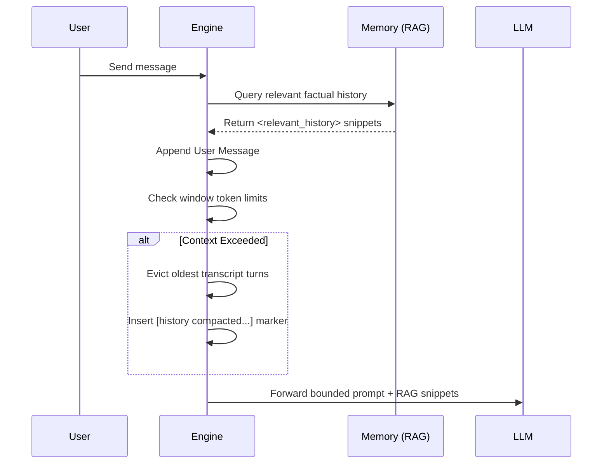

# Tandem Architecture

Tandem is an **engine-owned workflow runtime** for coordinated autonomous work. It is built as a multi-crate Rust workspace to support various clients (Desktop UI, TUI, Headless Server, and background bots) using a shared core engine.

## 1) Core Engine (Rust Crates)

The backend logic is modularized into several crates under `crates/`:

- **tandem-core**: The central library that coordinates projects, memory, and settings.
- **tandem-orchestrator**: Manages multi-agent execution, task graphs, scaling policies, and budget controls.
- **tandem-channels**: Handles headless bot integrations (Discord, Slack, Telegram).
- **tandem-memory**: SQLite-backed embeddings and full-text search indexing system.
- **tandem-providers**: Interfaces with external LLM providers (Cloudflare AI Gateway, local models, etc.).
- **tandem-skills & tandem-tools**: Manages execution of local, custom, and MCP (Model Context Protocol) tools like Composio or Arcade.
- **tandem-server**: The HTTP server exposing the core engine to API clients or channel bots.
- **tandem-observability & tandem-types**: Tracing, logging, and shared domain models.

## 2) Standalone Headless Engine (`tandem/engine`)

The `engine` directory contains the `tandem-ai` crate, which is the central executable and "brain" of the standalone Tandem runtime.

- **Purpose**: It wraps `tandem-core`, `tandem-server`, and the rest of the workspace crates into a single deployable binary.
- **Operation**: It runs the headless Tandem server (HTTP + SSE APIs). External clients, including channel bots, the TUI, or web dashboards, communicate with this engine.
- **Storage Root**: Standard installs should use one Tandem state root (`TANDEM_STATE_DIR`) so memory, config, logs, and session storage live together. A separate `TANDEM_MEMORY_DB_PATH` is supported only as an advanced override.
- **Execution**: Can be run locally via `cargo run -p tandem-ai -- serve` or packaged as prebuilt NPM binaries (`packages/tandem-engine`).

## 3) Desktop Application (Tauri + React/Vite)

The desktop application wraps the core Rust engine to provide a rich GUI.

- **Frontend (`src/`)**:
  - Standard React + Vite setup.
  - Manages chat views, file browsers, the tool staging area, and orchestration visualization.
  - Uses `src/lib/tauri.ts` to interface with the backend via IPC.
- **Backend (`src-tauri/src/`)**:
  - A Tauri v2 application that leverages the `tandem-*` crates.
  - Manages encrypted API keys (`keystore.rs`, `vault.rs`).
  - Handles local filesystem operations and GUI-specific state (like tool visual approvals).

## 4) Terminal User Interface (`crates/tandem-tui`)

The TUI provides a native terminal experience for developers who want to stay close to their code.

- **Stack**: Built with `ratatui` for modern, responsive terminal rendering via Crossterm.
- **Features**: Real-time markdown rendering of LLM responses, project configuration management, inline code blocks, and conversation session persistence.
- **Integration**: Operates as a distinct application frontend. It initializes `tandem-core` directly inside the terminal process, allowing for low-latency feedback without running a separate HTTP server.

## 5) Runtime Data Flow

1. **User Interaction**:
   - **Desktop**: User interacts with the React UI, which calls Tauri IPC commands. Tauri delegates to the core logic in the underlying crates and streams events back.
   - **TUI**: User interacts with the terminal interface, which directly uses the `tandem-core` engine.
   - **Channels**: A Discord/Telegram user sends a message. The `tandem-channels` crate processes it, queries the Orchestrator for agent logic, and returns the response asynchronously.
2. **Tool Execution**:
   - LLMs propose tool calls (like reading a file or querying an MCP resource).
   - In the Desktop app, risky tools require visual approval ("Zero Trust").
   - In TUI or Headless contexts, operations run according to the configured `Autonomy` policies.
   - **Crucially**, multi-agent synchronization happens via the engine's internal Blackboard and Git Worktree Isolation, ensuring concurrent autonomous tasks do not collide.

## 6) Security and Trust Boundaries

- Local-first design: API keys, SQLite databases, and project settings are stored securely on the user's filesystem.
- Operations that mutate the host machine (writing files, running terminal commands) are gated by policies and visual approvals in the Desktop app.
- Multi-agent orchestrators respect token budgets to prevent runaway LLM costs.

## 7) Context & Memory Management

Tandem is intentionally designed to avoid "context snowballing" or endless token accumulation bugs—an issue commonly seen when relying on recursive inline summarization loops.

Tandem uses a **strict sliding window** mechanism within its interaction loops (`compact_chat_history`). When a session approaches the context limitations of its designated model:

1. It truncates older conversational turns.
2. It substitutes them cleanly with static markers indicating omitted history rather than endlessly attempting to re-inject rules or summarize prior context strings.

To ensure agents do not lose critical facts during long-running sessions, historical insights and project context are offloaded to Semantic Metadata retrieval (RAG) rather than statically prepending huge workspace definitions. Relevant facts are fetched just-in-time from the `Memory` subsystem and injected cleanly into prompts (via `<relevant_history>` tags).
