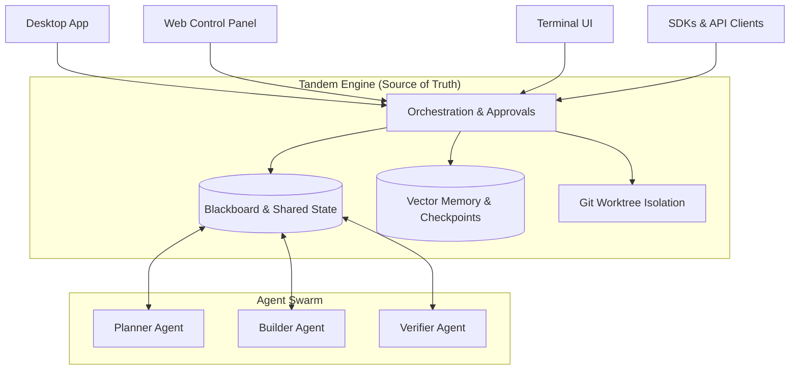

# Tandem Code Wiki

## 1. 项目概览

Tandem 是一个**引擎拥有的工作流运行时**，专为协调自主工作而设计。它采用分布式系统方法来处理智能体工程的复杂现实，优先考虑稳健的引擎状态而非脆弱的聊天记录。

### 核心价值
- **持久状态管理**：通过黑板、工作板、显式任务声明等机制实现
- **多智能体协调**：支持并行执行，避免智能体之间的冲突
- **引擎拥有的编排**：共享任务状态、重放、审批和确定性工作流投影
- **提供者无关**：支持 OpenRouter、Anthropic、OpenAI、OpenCode Zen 或本地 Ollama 端点

### 典型应用场景
- 安全地重构代码库
- 研究和总结多个信息源
- 生成定期报告
- 通过 MCP 连接外部工具
- 通过 API 操作 AI 工作流

## 2. 项目架构

Tandem 采用分层架构设计，将核心引擎、客户端和智能体系统清晰分离。

### 2.1 整体架构



### 2.2 核心组件

| 组件 | 职责 | 位置 |
|------|------|------|
| 核心引擎 | 提供工作流运行时、状态管理和编排功能 | `crates/` 目录 |
| 无头引擎 | 提供 HTTP/SSE API 服务 | `engine/` 目录 |
| 桌面应用 | 提供本地文件系统、审批和编排 UX | `src/` (前端) 和 `src-tauri/` (后端) |
| 控制面板 | 基于浏览器的操作界面 | `packages/tandem-control-panel/` |
| 终端用户界面 | 为开发者提供终端体验 | `crates/tandem-tui/` |
| SDKs | 提供 TypeScript 和 Python 客户端 | `packages/tandem-client-ts/` 和 `packages/tandem-client-py/` |

## 3. 核心模块

### 3.1 核心引擎模块 (`crates/`)

| 模块 | 职责 | 文件位置 |
|------|------|----------|
| tandem-core | 会话/状态/配置/存储、权限、工具路由、智能体注册表、引擎循环和共享默认值 | [crates/tandem-core](file:///workspace/crates/tandem-core) |
| tandem-server | HTTP/SSE API 表面、运行时状态、工作流、自动化、例程、包管理、智能体团队 | [crates/tandem-server](file:///workspace/crates/tandem-server) |
| tandem-runtime | 共享 PTY、LSP、MCP 和工作区索引助手 | [crates/tandem-runtime](file:///workspace/crates/tandem-runtime) |
| tandem-workflows | 工作流规范处理、工作流源跟踪、任务构建器模型和验证助手 | [crates/tandem-workflows](file:///workspace/crates/tandem-workflows) |
| tandem-agent-teams | 智能体团队清单的兼容性和路径助手 | [crates/tandem-agent-teams](file:///workspace/crates/tandem-agent-teams) |
| tandem-skills | 技能编目、加载和导出助手 | [crates/tandem-skills](file:///workspace/crates/tandem-skills) |
| tandem-tools | 工具注册表和执行策略管道 | [crates/tandem-tools](file:///workspace/crates/tandem-tools) |
| tandem-memory | 存储、嵌入、检索、治理和上下文层助手 | [crates/tandem-memory](file:///workspace/crates/tandem-memory) |
| tandem-providers | 提供者注册和身份验证/配置集成 | [crates/tandem-providers](file:///workspace/crates/tandem-providers) |
| tandem-browser | 浏览器侧车和浏览器自动化支持 | [crates/tandem-browser](file:///workspace/crates/tandem-browser) |
| tandem-channels | Discord、Slack 和 Telegram 集成 | [crates/tandem-channels](file:///workspace/crates/tandem-channels) |
| tandem-types | 共享域模型 | [crates/tandem-types](file:///workspace/crates/tandem-types) |
| tandem-wire | 传输/有线转换 | [crates/tandem-wire](file:///workspace/crates/tandem-wire) |
| tandem-observability | 进程日志记录 | [crates/tandem-observability](file:///workspace/crates/tandem-observability) |
| tandem-document | 文档实用程序 | [crates/tandem-document](file:///workspace/crates/tandem-document) |

### 3.2 前端模块 (`src/`)

| 模块 | 职责 | 文件位置 |
|------|------|----------|
| 聊天组件 | 提供聊天界面、消息显示、智能体选择等功能 | [src/components/chat](file:///workspace/src/components/chat) |
| 编排组件 | 提供黑板、任务板、智能体命令中心等功能 | [src/components/orchestrate](file:///workspace/src/components/orchestrate) |
| 设置组件 | 提供连接、语言、内存统计等设置功能 | [src/components/settings](file:///workspace/src/components/settings) |
| 文件组件 | 提供文件浏览器、文件预览等功能 | [src/components/files](file:///workspace/src/components/files) |
| 扩展组件 | 提供智能体目录、集成、模式、插件和技能管理 | [src/components/extensions](file:///workspace/src/components/extensions) |
| 技能组件 | 提供技能卡片和技能面板 | [src/components/skills](file:///workspace/src/components/skills) |
| 侧边栏组件 | 提供项目切换器和会话侧边栏 | [src/components/sidebar](file:///workspace/src/components/sidebar) |
| 计划组件 | 提供差异查看器、执行计划面板等功能 | [src/components/plan](file:///workspace/src/components/plan) |
| 智能体自动化组件 | 提供高级任务构建器、自动化日历等功能 | [src/components/agent-automation](file:///workspace/src/components/agent-automation) |
| 钩子 | 提供应用状态、模式、计划等自定义钩子 | [src/hooks](file:///workspace/src/hooks) |
| 工具库 | 提供 Tauri 接口、主题、会话范围等工具 | [src/lib](file:///workspace/src/lib) |

### 3.3 后端模块 (`src-tauri/src/`)

| 模块 | 职责 | 文件位置 |
|------|------|----------|
| 命令 | 提供各种 API 命令实现 | [src-tauri/src/commands](file:///workspace/src-tauri/src/commands) |
| 内存 | 提供内存索引和管理功能 | [src-tauri/src/memory](file:///workspace/src-tauri/src/memory) |
| 编排器 | 提供智能体编排、预算管理、调度等功能 | [src-tauri/src/orchestrator](file:///workspace/src-tauri/src/orchestrator) |
| Ralph | 提供循环执行和相关功能 | [src-tauri/src/ralph](file:///workspace/src-tauri/src/ralph) |
| 核心功能 | 提供文件监控、密钥库、LLM 路由等核心功能 | [src-tauri/src](file:///workspace/src-tauri/src) |

## 4. 关键类与函数

### 4.1 前端关键组件

#### Chat 组件
- **Chat.tsx**：主聊天界面组件，处理消息显示和用户输入
- **ChatInput.tsx**：聊天输入组件，处理用户输入和发送消息
- **Message.tsx**：消息显示组件，渲染聊天消息
- **AgentSelector.tsx**：智能体选择组件，允许用户选择不同的智能体

#### 编排组件
- **BlackboardPanel.tsx**：黑板面板组件，显示共享状态
- **TaskBoard.tsx**：任务板组件，显示和管理任务
- **OrchestratorPanel.tsx**：编排器面板组件，管理智能体编排

#### 设置组件
- **Settings.tsx**：设置主组件，管理各种设置选项
- **ConnectionsSettings.tsx**：连接设置组件，管理提供者连接
- **ModesSettings.tsx**：模式设置组件，管理智能体模式

### 4.2 后端关键模块

#### 编排器模块
- **orchestrator/mod.rs**：编排器模块的主入口
- **orchestrator/agents.rs**：智能体管理和协调
- **orchestrator/budget.rs**：预算管理，防止 LLM 成本失控
- **orchestrator/scheduler.rs**：任务调度和执行

#### 内存模块
- **memory/mod.rs**：内存模块的主入口
- **memory/indexer.rs**：内存索引和检索功能

#### 命令模块
- **commands/mod.rs**：命令模块的主入口
- **commands/messages.rs**：消息处理命令
- **commands/orchestrator_core.rs**：编排器核心命令
- **commands/memory.rs**：内存相关命令

## 5. 依赖关系

### 5.1 前端依赖
- **React**：前端 UI 库
- **Vite**：前端构建工具
- **TypeScript**：类型系统
- **Tailwind CSS**：样式框架
- **Tauri**：桌面应用框架

### 5.2 后端依赖
- **Rust**：后端开发语言
- **Tauri**：桌面应用框架
- **SQLite**：本地数据库
- **serde**：序列化/反序列化库
- **tokio**：异步运行时

### 5.3 核心引擎依赖
- **Rust**：核心开发语言
- **tokio**：异步运行时
- **serde**：序列化/反序列化库
- **hyper**：HTTP 服务器
- **rusqlite**：SQLite 驱动
- **tower**：HTTP 服务框架

## 6. 项目运行方式

### 6.1 开发环境设置

#### 前置条件
- Node.js 20+
- Rust 1.75+ (包含 cargo)
- pnpm (推荐) 或 npm

#### 平台特定要求
- **Windows**：Visual Studio 构建工具
- **macOS**：Xcode 命令行工具
- **Linux**：libwebkit2gtk-4.1-dev、libappindicator3-dev、librsvg2-dev、build-essential、pkg-config

#### 本地开发
```bash
git clone https://github.com/frumu-ai/tandem.git
cd tandem
pnpm install
cargo build -p tandem-ai
pnpm tauri dev
```

### 6.2 生产构建
```bash
pnpm tauri build
```

### 6.3 运行引擎

#### 桌面应用
1. 下载并启动 Tandem：[tandem.ac](https://tandem.ac/)
2. 打开 **设置** 并添加提供者 API 密钥
3. 选择工作区文件夹
4. 开始任务提示并选择 **立即** 或 **计划模式**

#### 控制面板
```bash
npm i -g @frumu/tandem
tandem install panel
tandem panel init
tandem panel open
```

#### 无头引擎
```bash
npm install -g @frumu/tandem
tandem-engine serve --hostname 127.0.0.1 --port 39731
```

#### 终端 UI
```bash
npm i -g @frumu/tandem-tui && tandem-tui
```

## 7. 关键 API 和使用示例

### 7.1 TypeScript SDK

```typescript
// npm install @frumu/tandem-client
import { TandemClient } from "@frumu/tandem-client";

const client = new TandemClient({ baseUrl: "http://localhost:39731", token: "..." });
const sessionId = await client.sessions.create({ title: "My agent" });
const { runId } = await client.sessions.promptAsync(sessionId, "Summarize README.md");

for await (const event of client.stream(sessionId, runId)) {
  if (event.type === "session.response") process.stdout.write(event.properties.delta ?? "");
}
```

### 7.2 Python SDK

```python
# pip install tandem-client
from tandem_client import TandemClient

async with TandemClient(base_url="http://localhost:39731", token="...") as client:
    session_id = await client.sessions.create(title="My agent")
    run = await client.sessions.prompt_async(session_id, "Summarize README.md")
    async for event in client.stream(session_id, run.run_id):
        if event.type == "session.response":
            print(event.properties.get("delta", ""), end="", flush=True)
```

## 8. 安全与隐私

### 8.1 安全特性
- **遥测**：Tandem 不包含分析/跟踪或调用回家遥测
- **提供者流量**：AI 请求内容仅发送到您配置的端点
- **网络范围**：桌面运行时与本地侧车 (`127.0.0.1`) 和配置的端点通信
- **更新器/版本检查**：应用更新和版本元数据流可以联系 GitHub 端点
- **凭证存储**：提供者密钥加密存储 (AES-256-GCM)
- **文件系统安全**：访问范围限定在授权文件夹；默认拒绝敏感路径

### 8.2 操作安全
- 写入/删除操作需要通过监督工具流进行审批
- 敏感路径默认被拒绝 (`.env`, `.ssh/*`, `*.pem`, `*.key`,  secrets 文件夹)
- 多智能体编排器遵守令牌预算，防止 LLM 成本失控

## 9. 配置与部署

### 9.1 环境变量

| 环境变量 | 描述 | 默认值 |
|----------|------|--------|
| TANDEM_STATE_DIR | Tandem 状态根目录 | 用户主目录下的默认位置 |
| TANDEM_SEARCH_BACKEND | 网络搜索后端 | auto |
| TANDEM_BRAVE_SEARCH_API_KEY | Brave 搜索 API 密钥 | 无 |
| TANDEM_EXA_API_KEY | Exa 搜索 API 密钥 | 无 |
| TANDEM_SEARXNG_URL | SearXNG 实例 URL | http://127.0.0.1:8080 |
| TANDEM_SEARCH_URL | 搜索服务 URL | https://search.tandem.ac |

### 9.2 提供者配置

| 提供者 | 描述 | 获取 API 密钥 |
|--------|------|--------------|
| **OpenRouter** ⭐ | 通过一个 API 访问多个模型 | [openrouter.ai/keys](https://openrouter.ai/keys) |
| **OpenCode Zen** | 为编码优化的快速、经济高效的模型 | [opencode.ai/zen](https://opencode.ai/zen) |
| **Anthropic** | Anthropic 模型 (Sonnet, Opus, Haiku) | [console.anthropic.com](https://console.anthropic.com/settings/keys) |
| **OpenAI** | GPT 模型和 OpenAI 端点 | [platform.openai.com](https://platform.openai.com/api-keys) |
| **Ollama** | 本地模型 (无需远程 API 密钥) | [设置指南](docs/OLLAMA_GUIDE.md) |
| **Custom** | 兼容 OpenAI 的 API 端点 | 配置端点 URL |

## 10. 监控与维护

### 10.1 日志系统
- 引擎日志存储在状态目录中
- 桌面应用和控制面板提供日志查看功能
- 支持通过命令行查看日志

### 10.2 常见问题排查

#### macOS 安装问题
如果下载的 `.dmg` 显示"损坏"或"已损坏"，通常是 Gatekeeper 拒绝了未签名和未公证的应用程序包/DMG。
1. 确认正确的架构 (`aarch64/arm64` vs `x86_64/x64`)。
2. 尝试通过 Finder 打开 (`右键 -> 打开` 或 `系统设置 -> 隐私与安全 -> 仍然打开`)。
3. 对于非技术分发，使用发布自动化中的签名 + 公证工件。

## 11. 开发指南

### 11.1 贡献流程
1. 克隆仓库
2. 安装依赖
3. 运行测试和 lint
4. 提交 PR

### 11.2 开发命令
```bash
# 运行 lints
pnpm lint

# 运行测试
pnpm test
cargo test

# 格式化代码
pnpm format
cargo fmt
```

### 11.3 构建与发布
- 桌面二进制/应用发布：`.github/workflows/release.yml` (标签模式 `v*`)
- 注册表发布 (crates.io + npm 包装器)：`.github/workflows/publish-registries.yml` (手动触发或 `publish-v*`)

## 12. 总结与亮点回顾

Tandem 是一个创新的引擎拥有的工作流运行时，为协调自主工作提供了强大的基础。其核心优势包括：

- **持久状态管理**：通过黑板、工作板和检查点确保工作流的连续性
- **多智能体协调**：支持并行执行，避免智能体之间的冲突
- **引擎拥有的编排**：共享任务状态、重放、审批和确定性工作流投影
- **本地优先设计**：数据和状态留在用户机器上，增强安全性和隐私性
- **提供者无关**：支持多种 LLM 提供者，包括本地选项
- **开源和可审计**：核心引擎采用 MIT/Apache 许可证，确保透明度和社区参与

Tandem 为 AI 辅助软件开发和自动化提供了一个强大、安全且灵活的平台，通过将自主执行视为分布式系统问题，解决了当前 AI 智能体在规模上的局限性。

## 13. 参考资料

- [Tandem 官方网站](https://tandem.ac/)
- [Tandem 文档](https://docs.tandem.ac/)
- [架构概述](ARCHITECTURE.md)
- [引擎运行时 + CLI 参考](docs/ENGINE_CLI.md)
- [桌面/运行时通信契约](docs/ENGINE_COMMUNICATION.md)
- [引擎测试和冒烟检查](docs/ENGINE_TESTING.md)
- [安全文档](SECURITY.md)