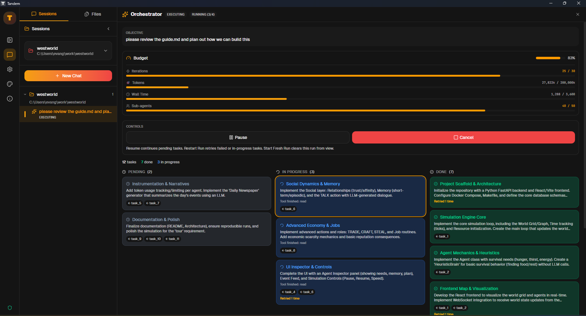

<div align="center">
  
  
  <p>
    <a href="https://tandem.frumu.ai/"></a>
    <a href="https://github.com/frumu-ai/tandem/actions/workflows/ci.yml"></a>
    <a href="https://github.com/frumu-ai/tandem/actions/workflows/release.yml"></a>
    <a href="LICENSE"></a>
    <a href="https://github.com/sponsors/frumu-ai"></a>
  </p>
</div>

A local-first, privacy-focused AI workspace. Your AI coworker that runs entirely on your machine.

<div align="center">
  
</div>

Inspired by early AI coworking research previews, but open source and provider-agnostic.

## Why Tandem?

**🔒 Privacy First**: Unlike cloud-based AI tools, Tandem runs on your machine. Your code, documents, and API keys never touch our servers because we don't have any.

**💰 Provider Agnostic**: Use any LLM provider - don't get locked into one vendor. Switch between OpenRouter, Anthropic, OpenAI, or run models locally with Ollama.

**🛡️ Zero Trust**: Every file operation requires explicit approval. AI agents are powerful but Tandem treats them as "untrusted contractors" with supervised access.

**🌐 True Cross-Platform**: Native apps for Windows, macOS (Intel & Apple Silicon), and Linux. No Electron bloat - built on Tauri for fast, lightweight performance.

**📖 Open Source**: MIT licensed. Review the code, contribute features, or fork it for your needs.

**🛠️ Modern Stack**: Built with **Rust**, **Tauri**, **React**, and **sqlite-vec** — designed for high performance and low memory footprint on consumer hardware.

## Developer Superpowers for Everyone

In 2024, AI coding tools like Cursor transformed how developers work - letting them interact with entire codebases, automate complex tasks, and review changes before they happen.

**But why should only programmers have these capabilities?**

- Researchers need to synthesize hundreds of papers
- Writers need consistency across sprawling manuscripts
- Analysts need to cross-reference quarterly reports
- Administrators need to organize mountains of documents

Tandem brings the same transformative capabilities to everyone. Point it at any folder of files, and you get:

- **Folder-wide intelligence** - AI that understands your entire collection, not just one file
- **Multi-step automation** - Complex tasks broken into reviewable steps
- **Visual change review** - See exactly what will change before it happens
- **Complete undo** - Roll back any operation with one click

What Cursor did for developers, Tandem does for everyone.

## Features

### Core Capabilities

- **🔒 Zero telemetry** - No data leaves your machine except to your chosen LLM provider
- **🔄 Provider freedom** - Use OpenRouter, Anthropic, OpenAI, Ollama, or any OpenAI-compatible API
- **🛡️ Secure by design** - API keys stored in encrypted vault using AES-256-GCM, never in plaintext
- **🌐 Cross-platform** - Native installers for Windows, macOS (Intel & Apple Silicon), and Linux
- **👁️ Visual permissions** - Approve every file access and action with granular control
- **⏪ Full undo** - Rollback any AI operation with comprehensive operation journaling
- **🧠 Long-Term Memory** - Vector database stores codebase context and history for smarter answers
- **🧩 Skills System** - Import and manage custom AI capabilities and instructions
- **🏷️ Skill runtime hints** - Starter skill cards show optional runtime requirements (Python/Node/Bash)
- **📎 Document text extraction** - Extract text from PDF/DOCX/PPTX/XLSX/RTF for skills and chat context
- **🐍 Workspace Python venv** - Guided setup creates `.tandem/.venv` and enforces venv-only tools
- **🎨 Rich themes** - Enhanced background art and consistent gradient rendering across the app
- **📋 Execution Planning** - Review and batch-approve multi-step AI operations before execution
- **🔄 Auto-updates** - Seamless updates with code-signed releases (when using installers)

### AI Agent Modes

Tandem supports multiple specialized agent modes powered by the native Tandem engine:

- **💬 Chat Mode** - Interactive conversation with context-aware file operations
- **📝 Plan Mode** - Draft comprehensive implementation plans (`.md`) before executing changes
- **♾️ Ralph Loop** - Autonomous iterative loop that works until a task is verifiably complete
- **🔍 Ask Mode** - Read-only exploration and analysis without making changes
- **🐛 Debug Mode** - Systematic debugging with runtime evidence

### 🎼 Multi-Agent Orchestration

**New in v0.2.0**: Tandem now features a powerful Orchestration Mode that coordinates specialized sub-agents to solve complex problems.

<div align="center">
  
</div>

Instead of a single AI trying to do everything, Tandem builds a dependency graph of tasks and delegates them to:

- **Planner**: Architect your solution
- **Builder**: Write the code
- **Validator**: Verify the results

This supervised loop ensures complex features are implemented correctly with human-in-the-loop approval at every critical step.

### Project Management

- **📁 Multi-project support** - Manage multiple workspaces with separate contexts
- **🔐 Per-project permissions** - Fine-grained file access control
- **📊 Project switching** - Quick navigation between different codebases
- **💾 Persistent history** - Chat history saved per project

### Artifacts & Outputs

- **📊 HTML/Canvas** - Generate secure, interactive HTML dashboards and reports
- **📽️ Presentation Engine** - Export high-fidelity PPTX slides with theme support
- **📑 Markdown Reports** - Clean, formatted documents and plans

## Quick Start

### Prerequisites

- [Node.js](https://nodejs.org/) 20+
- [Rust](https://rustup.rs/) 1.75+
- [pnpm](https://pnpm.io/) (recommended) or npm

**Platform-specific:**

| Platform | Additional Requirements                                                                          |
| -------- | ------------------------------------------------------------------------------------------------ |
| Windows  | [Build Tools for Visual Studio](https://visualstudio.microsoft.com/downloads/)                   |
| macOS    | Xcode Command Line Tools: `xcode-select --install`                                               |
| Linux    | `libwebkit2gtk-4.1-dev`, `libappindicator3-dev`, `librsvg2-dev`, `build-essential`, `pkg-config` |

### Installation

1. **Clone the repository**

   ```bash
   git clone https://github.com/frumu-ai/tandem.git
   cd tandem
   ```

2. **Install dependencies**

   ```bash
   pnpm install
   ```

3. **Build the engine binary**

   ```bash
   cargo build -p tandem-engine
   ```

   This builds the native Rust `tandem-engine` binary for your platform.

4. **Run in development mode**
   ```bash
   pnpm tauri dev
   ```

### Building for Production

If you want to build a distributable installer, run:

```bash
# Build for current platform
pnpm tauri build
```

**Note on Code Signing:**
Tandem uses Tauri's secure updater. If you are building the app for yourself, you will need to generate your own signing keys:

1. Generate keys: `pnpm tauri signer generate -w ./src-tauri/tandem.key`
2. Set environment variables:
   - `TAURI_SIGNING_PRIVATE_KEY`: The content of the `.key` file
   - `TAURI_SIGNING_PASSWORD`: The password you set during generation
3. Update the `pubkey` in `src-tauri/tauri.conf.json` with your new public key.

For more details, see the [Tauri signing documentation](https://tauri.app/v1/guides/distribution/updater/#signing-updates).

### macOS install troubleshooting

If a macOS user downloads the `.dmg` from GitHub Releases and macOS says the app is **"damaged"** or **"corrupted"**, this is usually Gatekeeper rejecting an app bundle/DMG that is **not Developer ID signed and notarized**.

Things to check:

1. Download the correct DMG for the Mac:
   - Apple Silicon (M1/M2/M3): `aarch64-apple-darwin` / `arm64`
   - Intel: `x86_64-apple-darwin` / `x64`
2. Try opening via Finder:
   - Right click the app -> `Open` (or `System Settings -> Privacy & Security` -> `Open Anyway`)

For distribution to non-technical users, the real fix is to ship macOS artifacts that are **signed + notarized**. The release workflow (`.github/workflows/release.yml`) supports this once the Apple signing/notarization secrets are configured.

```bash
# Output locations:
# Windows: src-tauri/target/release/bundle/msi/
# macOS:   src-tauri/target/release/bundle/dmg/
# Linux:   src-tauri/target/release/bundle/appimage/
```

## Configuration

### Setting Up Your LLM Provider

Tandem supports multiple LLM providers. Configure them in Settings:

1. Launch Tandem
2. Click the **Settings** icon (gear) in the sidebar
3. Choose and configure your provider:

**Supported Providers:**

| Provider          | Description                                      | Get API Key                                                          |
| ----------------- | ------------------------------------------------ | -------------------------------------------------------------------- |
| **OpenRouter** ⭐ | Access 100+ models through one API (recommended) | [openrouter.ai/keys](https://openrouter.ai/keys)                     |
| **OpenCode Zen**  | Fast, cost-effective models optimized for coding | [opencode.ai/zen](https://opencode.ai/zen)                           |
| **Anthropic**     | Anthropic models (Sonnet, Opus, Haiku)           | [console.anthropic.com](https://console.anthropic.com/settings/keys) |
| **OpenAI**        | GPT-4, GPT-3.5 and other OpenAI models           | [platform.openai.com](https://platform.openai.com/api-keys)          |
| **Ollama**        | Run models locally (no API key needed)           | [Setup Guide](docs/OLLAMA_GUIDE.md)                                  |
| **Custom**        | Any OpenAI-compatible API endpoint               | Configure endpoint URL                                               |

4. Enter your API key - it's encrypted with AES-256-GCM and stored securely in the local vault
5. (Optional) Configure model preferences and endpoints

### Granting Folder Access

Tandem operates on a **zero-trust model** - it can only access folders you explicitly grant permission to:

1. Click **Projects** in the sidebar
2. Click **+ New Project** or **Select Workspace**
3. Choose a folder via the native file picker
4. Tandem can now read/write files in that folder (with your approval)

You can manage multiple projects and switch between them easily. Each project maintains its own:

- Chat history
- Permission settings
- File access scope

## Architecture

```
┌─────────────────────────────────────────────────────────────┐
│                    Tandem Desktop App                        │
├─────────────────┬───────────────────┬───────────────────────┤
│  React Frontend │   Tauri Core      │  Tandem Engine Sidecar│
│  (TypeScript)   │   (Rust)          │  (AI Agent Runtime)   │
│  - Modern UI    │   - Security      │  - Multi-mode agents  │
│  - File browser │   - Permissions   │  - Tool execution     │
│  - Chat interface│  - State mgmt    │  - Context awareness  │
├─────────────────┴───────────────────┴───────────────────────┤
│                SecureKeyStore (AES-256-GCM)                  │
│              Encrypted API keys • Secure vault               │
└─────────────────────────────────────────────────────────────┘
```

**Tech Stack:**

- **Frontend**: React 18, TypeScript, Tailwind CSS, Framer Motion
- **Backend**: Rust, Tauri 2.0
- **Agent Runtime**: Tandem Engine (Rust, HTTP + SSE)
- **Encryption**: AES-256-GCM for API key storage
- **IPC**: Tauri's secure command system

### Supervised Agent Pattern

Tandem treats the AI as an "untrusted contractor":

- All operations go through a **Tool Proxy**
- Write operations require **user approval**
- Full **operation journal** with undo capability
- **Circuit breaker** for resilience
- **Execution Planning** - Review all changes as a batch before applying

#### Plan Mode vs Immediate Mode

Tandem offers two modes for handling AI operations:

**Immediate Mode** (default):

- Approve each file change individually via toast notifications
- Good for quick, small changes
- Traditional AI assistant experience

**Plan Mode** (recommended for complex tasks):

- Toggle with the **"Plan Mode"** button in the chat header
- Uses Tandem's native Plan mode runtime
- AI proposes file operations that are staged for review
- All changes appear in the **Execution Plan panel** (bottom-right)
- Review diffs side-by-side before applying
- Remove unwanted operations
- Execute all approved changes with one click

**How to use Plan Mode:**

1. Click "Immediate" → "Plan Mode" toggle in header
2. Ask AI to make changes (e.g., "Refactor the auth system")
3. AI proposes operations → they appear in Execution Plan panel
4. Review diffs and operations
5. Click **"Execute Plan"** button in panel
6. All changes applied together + AI continues

The Execution Plan panel appears automatically when the AI proposes file changes in Plan Mode.

- Full undo support for the entire batch

Toggle between modes using the button in the chat header.

## Security

Tandem is built with security and privacy as core principles:

- **🔐 API keys**: Encrypted with AES-256-GCM in SecureKeyStore, never stored in plaintext
- **📁 File access**: Scoped to user-selected directories only - zero-trust model
- **🌐 Network**: Only connects to localhost (sidecar) + user-configured LLM endpoints
- **🚫 No telemetry**: Zero analytics, zero tracking, zero call home
- **✅ Code-signed releases**: All installers are signed for security (Windows, macOS)
- **🔒 Sandboxed**: Tauri security model with CSP and permission system
- **💾 Local-first**: All data stays on your machine unless sent to your LLM provider

**Denied by default:**

- `.env` files and environment variables
- `.pem`, `.key` files
- SSH keys (`.ssh/*`)
- Secrets folders
- Password databases

See [SECURITY.md](SECURITY.md) for our complete security model and threat analysis.

## Contributing

We welcome contributions! Please see [CONTRIBUTING.md](CONTRIBUTING.md).

```bash
# Run lints
pnpm lint

# Run tests
pnpm test
cargo test

# Format code
pnpm format
cargo fmt
```

Engine-specific build/run/smoke instructions (including `pnpm tauri dev` sidecar setup): see `docs/ENGINE_TESTING.md`.
Engine CLI usage reference (commands, flags, examples): see `docs/ENGINE_CLI.md`.
Engine runtime communication contract (desktop/TUI <-> engine): see `docs/ENGINE_COMMUNICATION.md`.

## Project Structure

```
tandem/
├── src/                    # React frontend
│   ├── components/         # UI components
│   ├── hooks/              # React hooks
│   └── lib/                # Utilities
├── src-tauri/              # Rust backend
│   ├── src/                # Rust source
│   ├── capabilities/       # Permission config
│   └── binaries/           # Sidecar (gitignored)
├── scripts/                # Build scripts
└── docs/                   # Documentation
```

## Roadmap

- [x] **Phase 1: Security Foundation** - Encrypted vault, permission system
- [x] **Phase 2: Sidecar Integration** - Tandem agent runtime
- [x] **Phase 3: Glass UI** - Modern, polished interface
- [x] **Phase 4: Provider Routing** - Multi-provider support
- [x] **Phase 5: Agent Capabilities** - Multi-mode agents, execution planning
- [x] **Phase 6: Project Management** - Multi-workspace support
- [x] **Phase 7: Advanced Presentations** - PPTX export engine, theme mapping, explicit positioning
- [x] **Phase 8: Brand Evolution** - Rubik 900 typography, polished boot sequence
- [x] **Phase 9: Memory & Context** - Vector database integration (`sqlite-vec`)
- [x] **Phase 10: Skills System** - Importable agent skills and custom instructions
- [ ] **Phase 11: Browser Integration** - Web content access
- [ ] **Phase 12: Team Features** - Collaboration tools
- [ ] **Phase 13: Mobile Companion** - iOS/Android apps

See [docs/todo_specialists.md](docs/todo_specialists.md) for ideas on specialized AI assistants for non-technical users.

## Why Tandem?

For developers and teams who want:

- **Control**: Your data, your keys, your rules
- **Flexibility**: Any LLM provider, any model
- **Security**: Encrypted storage, sandboxed execution, zero telemetry
- **Transparency**: Open source, auditable code

For a deeper dive into Tandem's philosophy and how it compares to other tools, see our [Marketing Guide](docs/marketing.md).

## Support This Project

If Tandem saves you time or helps you keep your data private while using AI, consider [sponsoring development](https://github.com/sponsors/frumu-ai). Your support helps with:

- Cross-platform packaging and code signing
- Security hardening and privacy features
- Quality-of-life improvements and bug fixes
- Documentation and examples

[❤️ Become a Sponsor](https://github.com/sponsors/frumu-ai)

## License

[MIT](LICENSE) - Use it however you want.

## Acknowledgments

- [Anthropic](https://anthropic.com) for the Cowork inspiration
- [Tauri](https://tauri.app) for the secure desktop framework
- The open source community

---

**Tandem** - Your local-first AI coworker.

---

_Note: This codebase communicates with the native `tandem-engine` sidecar binary for AI agent capabilities and routes to various LLM providers (OpenRouter, Anthropic, OpenAI, Ollama, or custom APIs). All communication stays local except for LLM provider API calls._
