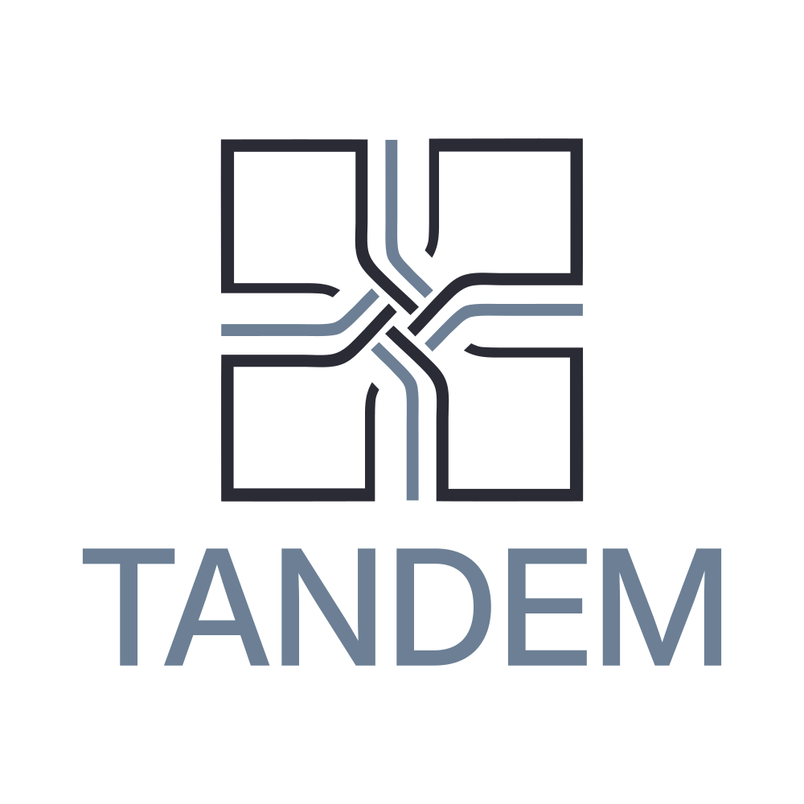
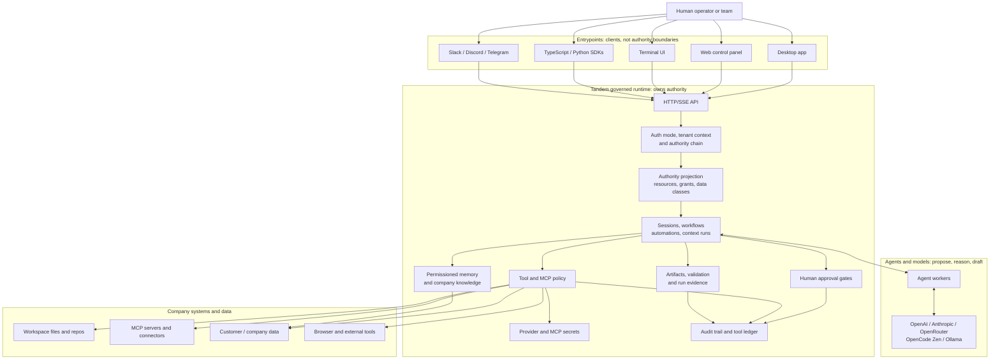

<div align="center">
  
  
  <p>
    <a href="https://tandem.ac/"></a>
    <a href="https://github.com/frumu-ai/tandem/actions/workflows/ci.yml"></a>
    <a href="https://github.com/frumu-ai/tandem/actions/workflows/publish-registries.yml"></a>
    <a href="https://github.com/frumu-ai/tandem/releases"></a>
    <a href="https://www.npmjs.com/package/@frumu/tandem-client"></a>
    <a href="https://pypi.org/project/tandem-client/"></a>
    <a href="docs/LICENSING.md"></a>
  </p>
</div>

<p align="center">
  <a href="README.md">English</a> | <a href="README.zh-CN.md">简体中文</a>
</p>

<p align="center">
  <strong>Interested in Tandem Hosted?</strong>
  <a href="https://tandem.ac/agents?utm_source=github&utm_medium=readme&utm_campaign=hosted_waitlist&utm_content=top_banner">Join the waitlist</a>
</p>

<h1 align="center">Tandem</h1>

**Tandem enforces policy between AI agents and the tools, data, memory, and actions they use.**

Agents can reason, draft, and propose work. Tandem decides what they are authorized to see, which tools they can call, which actions must pause for approval, what memory/context they can access, and what evidence gets recorded.

This makes Tandem useful when agents touch real company systems: files, repositories, email, MCP tools, customer data, internal docs, production workflows, and long-running automations.

For platform and security teams, Tandem acts as a runtime control plane for agentic systems: scoped tool access, approval gates, permissioned memory, tenant/resource boundaries, and audit evidence.

**The model proposes. Tandem enforces.**

In governance terms, Tandem manages delegated authority for AI agents at runtime.

## What Tandem Does

- Runs AI workflows with durable state instead of transcript-only execution.
- Scopes which built-in tools and MCP connectors are visible at each workflow step.
- Blocks tool calls that fall outside runtime policy before execution.
- Pauses consequential actions for human approval.
- Controls which company memory and context a run can retrieve.
- Records artifacts, tool events, approval decisions, and audit evidence outside the model context window.

## Simple Example

An agent may be allowed to draft a customer email, but not send it.

Tandem can expose the draft tool, hide or block the send tool, pause at an approval gate, resume only after a human approves, and record the decision in the audit trail.

## What Tandem Is Not

| Not this                 | Instead                                                                |
| ------------------------ | ---------------------------------------------------------------------- |
| Chatbot wrapper          | Runtime layer underneath agents and workflows                          |
| Agent framework only     | Policy layer that controls what agent workflows can see and do         |
| Approval UI only         | Runtime enforcement with approvals as one controlled gate              |
| LLM gateway only         | Governs workflow state, tools, memory, approvals, artifacts, and audit |
| Flat RAG system          | Runtime-scoped memory and source-bound retrieval                       |
| Prompt-only safety layer | Enforcement happens outside the model                                  |

Tandem calls this **runtime authority**: authorization, execution control, approval, scoped memory, and audit enforced outside the model. Entrypoints such as the desktop app, TUI, web control panel, channels, and SDKs are clients of the same engine runtime.

- **Runtime-owned controls:** Runs, sessions, memory, context, provider secrets, MCP tools, approvals, artifacts, and audit records live outside the model.
- **Governed tool execution:** Built-in tools and MCP connectors can be scoped per workflow step, with approval gates for consequential actions.
- **Tenant-aware runtime:** Hosted and enterprise modes carry tenant/principal context through sessions, runs, context runs, memory, provider credentials, MCP secrets, and events.
- **Deployable where the data lives:** Tandem can run locally, headlessly, hosted, or inside customer infrastructure.
- **Provider agnostic:** Use OpenRouter, Anthropic, OpenAI, OpenCode Zen, or local Ollama endpoints.

`Agent intent -> Runtime policy -> Scoped tool/data access -> Approval gates -> Artifacts -> Audit trail`

**-> [AI runtime infrastructure](docs/AI_RUNTIME_INFRASTRUCTURE.md) | [Enterprise readiness](docs/ENTERPRISE_READINESS.md) | [Runtime trust boundaries](docs/RUNTIME_TRUST_BOUNDARIES.md) | [EU AI Act readiness](docs/EU_AI_ACT_COMPLIANCE.md) | [Compliance starter pack](docs/compliance/README.md) | [Connect an agent via MCP](https://tandem.ac/docs-mcp)**

## Why Tandem Exists

Agents are becoming workers. They read company context, call tools, open pull requests, draft customer communication, operate project boards, and prepare decisions that used to stay inside human-only systems.

Prompts are not permissions. A system prompt can ask a model to avoid a tool, skip a folder, or wait for approval, but the model should not be the security boundary. Tandem puts those controls in the runtime, so a workflow can grant the agent only the tools, memory, and actions needed for the current step — and deny anything outside that scope.

Companies also need central AI context without flat access. A permissioned company memory should know what the company knows, but an agent acting for one team, tenant, project, or user should only retrieve the slice it is allowed to use.

## What Tandem Governs

- **Company knowledge and memory:** Runtime-owned memory, knowledge spaces, and retrieval paths designed around tenant and workspace boundaries.
- **Tool and MCP visibility:** Step-scoped built-in tools and MCP connector tools, with broader pre-invocation masking planned for enterprise deployments.
- **Workflow execution:** Durable automation and context-run state instead of fragile transcript-only execution.
- **Human approvals:** Runtime gates pause runs, collect approve/rework/cancel decisions, and leave evidence.
- **Tenant and workspace boundaries:** Tenant-aware sessions, runs, context runs, events, provider credentials, MCP secrets, memory, and contract vocabulary for resource scopes and grants.
- **Connector credentials and secrets:** Provider and MCP secret references are runtime-owned; connector source binding gives scoped ingestion a shared contract as that layer matures.
- **Artifacts and audit trails:** Outputs, validations, tool ledger events, approval decisions, and protected audit records survive outside the model context window.

## Core Use Cases

| Use case                           | What Tandem adds                                                                                       |
| ---------------------------------- | ------------------------------------------------------------------------------------------------------ |
| Approval-gated email and workflows | Agent proposes work, Tandem pauses before the action, a human approves or requests rework.             |
| Permissioned company knowledgebase | Company memory and knowledge spaces with tenant-aware retrieval and resource-grant vocabulary.         |
| Governed coding agents             | Coder runs, worktree context, handoff artifacts, approval points, and auditable implementation state.  |
| Project, sprint, and event brain   | Long-running context, tasks, artifacts, and memory that survive across sessions and teams.             |
| Tenant-isolated hosted automations | Hosted runtime records, event streams, provider credentials, MCP secrets, and memory scoped by tenant. |
| Internal agent and tool governance | A control point for which agents can see which tools, execute which actions, and leave which evidence. |

## Why Platform And Security Teams Care

Tandem is designed for teams that need to run AI work under real operational controls:

- **Runtime authority, not prompt authority:** The model can request context or a tool call; the runtime decides what is visible and executable.
- **Tenant-aware records:** Sessions, automation runs, context runs, event streams, provider credentials, MCP secrets, and memory paths carry tenant context in hosted/shared modes.
- **Resource and grant model:** Tandem models resources, principals, grants, data classes, and data boundaries so access decisions can be enforced by the runtime.
- **Permissioned memory:** Memory and knowledge paths carry tenant boundaries so company knowledge can become useful without becoming globally flat.
- **Deployable runtime:** The same runtime can run on a laptop, as a headless engine, hosted, or inside customer infrastructure as the enterprise layer matures.
- **Auditability:** Approval decisions, policy denials, provider secret changes, MCP activity, tool ledger events, artifacts, and protected audit records can be inspected outside chat transcripts.

## Deployment Model

Tandem is useful locally and grows toward stricter company deployments:

- **Local desktop:** Single-user desktop runtime with local workspace scope, provider setup, and approval-gated tools.
- **Headless engine:** `tandem-engine serve` for SDKs, control panels, automations, and CI/dev environments.
- **Hosted/private managed:** Hosted deployments with transport-token and signed context assertions for tenant-aware access.
- **Customer infrastructure:** A deployment model for running where company data, connector credentials, and operational evidence need to live.

## Current Status

| Current capabilities                                                                             | Enterprise roadmap                                                                             |
| ------------------------------------------------------------------------------------------------ | ---------------------------------------------------------------------------------------------- |
| Runtime auth modes: `local_single_tenant`, `hosted_single_tenant`, `enterprise_required`         | Full RBAC, OIDC, SCIM, SIEM integrations, SOC2 package, and enterprise identity policy bridge  |
| Tenant context and signed context assertions for hosted/enterprise ingress                       | Private enterprise sidecar with fail-closed policy authorization                               |
| Tenant-aware sessions, automation runs, context runs, events, coder routes, and memory APIs      | Complete artifact/export isolation across every path                                           |
| Provider credential and MCP secret tenant boundaries                                             | Full tool-discovery masking before model invocation                                            |
| Memory tenant partitioning, tenant-scoped knowledge spaces, and resource-scoped retrieval APIs   | Production connector ingestion admin platform with live external source ingestion              |
| Resource access-control contract types and strict context projection vocabulary                  | Signed approval receipts and auditor-grade immutable receipt chains                            |
| Approval gates, pending approval inbox, channel approvals, tool ledger events, and audit records | Advanced connector quarantine/revoke/rotate operations wired to production ingestion workflows |

## Compliance and AI Act readiness

Tandem helps teams operate AI workflows with human oversight, scoped tools, durable execution evidence, and protected-action controls. For regulated or security-sensitive deployments, start with the [EU AI Act readiness brief](docs/EU_AI_ACT_COMPLIANCE.md), then use the [Compliance Starter Pack](docs/compliance/README.md) for control mapping, Article 50 transparency guidance, deployer instructions, an Annex IV documentation template, and a limitations/responsibility matrix.

## 30-second quickstart

### Web Control Panel

Install the master CLI, then bootstrap the panel and its engine service:

```bash
npm i -g @frumu/tandem
tandem install panel
tandem panel init
tandem panel open
```

Use this when you want the browser-based control center backed by the engine.

For local installs, you can now open **Settings -> Providers -> openai-codex** and choose **Connect Codex Account** to sign in through the browser instead of pasting an OpenAI API key.

### Desktop

1. Download and launch Tandem: [tandem.ac](https://tandem.ac/)
2. Open **Settings** and add a provider API key, or use the local control panel to connect a Codex account for `openai-codex`.
3. Select a workspace folder.
4. Start with a task prompt and choose **Immediate** or **Plan Mode**.

### Editable App Scaffold

Generate a fully editable control panel app in your own folder:

```bash
npm create tandem-panel@latest my-panel
cd my-panel
npm install
npm run dev
```

Use this when you want to customize routes, pages, themes, styles, or runtime behavior without editing `node_modules`.

### MCP-assisted setup

If you want an existing agent to help install or configure Tandem, connect that agent to Tandem's MCP interface first. The MCP docs explain how to wire your own agent into Tandem so it can assist with setup, configuration, and follow-up tasks:

- [Tandem MCP docs](https://tandem.ac/docs-mcp)

If you only want the engine runtime, you can keep it foreground-only:

```bash
tandem-engine serve --hostname 127.0.0.1 --port 39731
```

### Other Entry Points

- TUI: `npm i -g @frumu/tandem-tui && tandem-tui`
- SDKs: `npm install @frumu/tandem-client` or `pip install tandem-client`

### Codex And Docker Setup

- Codex users can connect Tandem through the [tandem-codex-plugin](https://github.com/frumu-ai/tandem-codex-plugin) repository.
- For a Docker-based Tandem agents setup, see [tandem-agents](https://github.com/frumu-ai/tandem-agents).

## Open Core & Source-Available Architecture

Tandem is built for developers first, using an open-core model. We believe that to trust an AI runtime, you must be able to audit the execution router line-by-line.

**Local Development & Evaluation:** The permissively licensed crates and libraries (`MIT OR Apache-2.0`) may be used under their own terms. Every distributed engine binary also includes the source-available `BUSL-1.1` components, which are free for evaluation, development, testing, source inspection, personal non-commercial use, and non-production proofs of concept.

**Enterprise Path:** Advanced features for scaled organizational deployments, such as enterprise identity federation, richer policy enforcement, signed receipt chains, private sidecar enforcement, SIEM export, and HA packaging, are planned enterprise capabilities and may be governed under commercial or source-available terms, including the Business Source License 1.1 (`BUSL-1.1`) where declared.

**License Boundary:** Commercial production use of the `BUSL-1.1` components — including internal production use, client production deployments, and managed, hosted, SaaS, white-label, embedded, OEM, or reseller offerings — requires a separate commercial license from Frumu LTD. See [docs/LICENSING.md](docs/LICENSING.md) for the exact package-by-package terms.

## Architecture


```mermaid
flowchart TD
    Human[Human operator or team]

    subgraph Entrypoints["Entrypoints: clients, not authority boundaries"]
        Desktop[Desktop app]
        Panel[Web control panel]
        TUI[Terminal UI]
        SDK[TypeScript / Python SDKs]
        Channels[Slack / Discord / Telegram]
    end

    subgraph Agents["Agents and models: propose, reason, draft"]
        Workers[Agent workers]
        Models[OpenAI / Anthropic / OpenRouter<br/>OpenCode Zen / Ollama]
    end

    subgraph Tandem["Tandem governed runtime: owns authority"]
        API[HTTP/SSE API]
        Tenant[Auth mode, tenant context<br/>and authority chain]
        Projection[Authority projection<br/>resources, grants, data classes]
        Runs[Sessions, workflows<br/>automations, context runs]
        Gates[Human approval gates]
        Policy[Tool and MCP policy]
        Memory[Permissioned memory<br/>and company knowledge]
        Secrets[Provider and MCP secrets]
        Artifacts[Artifacts, validation<br/>and run evidence]
        Audit[Audit trail and tool ledger]
    end

    subgraph Systems["Company systems and data"]
        Workspace[Workspace files and repos]
        MCP[MCP servers and connectors]
        Data[Customer / company data]
        Browser[Browser and external tools]
    end

    Human --> Desktop
    Human --> Panel
    Human --> TUI
    Human --> SDK
    Human --> Channels

    Desktop --> API
    Panel --> API
    TUI --> API
    SDK --> API
    Channels --> API

    API --> Tenant
    Tenant --> Projection
    Projection --> Runs
    Runs <--> Workers
    Workers <--> Models

    Runs --> Gates
    Runs --> Policy
    Runs --> Memory
    Runs --> Artifacts
    Gates --> Audit
    Policy --> Audit
    Artifacts --> Audit

    Policy --> Secrets
    Policy --> Workspace
    Policy --> MCP
    Policy --> Data
    Policy --> Browser
    Memory --> Data
```

## Common workflows

| Governed workflow                | What the Tandem runtime controls                                                                                    |
| -------------------------------- | ------------------------------------------------------------------------------------------------------------------- |
| Evaluate vendor or policy risk   | Read selected sources, draft cited artifacts, validate limitations, and keep mutation tools outside the read step.  |
| Approval-gated email or updates  | Let an agent draft the action, pause at a human gate, resume only after approve/rework/cancel evidence is recorded. |
| Execute code migrations          | Track coder runs, worktree state, changed files, validation, handoff artifacts, and approval points.                |
| Govern external MCP tools        | Scope connector tools by workflow step, require concrete tool evidence, and isolate MCP secrets by tenant path.     |
| Permissioned company memory      | Retrieve company context through runtime-owned memory and knowledge spaces instead of pasting everything into chat. |
| Tenant-isolated hosted workflows | Keep sessions, runs, events, credentials, MCP secrets, and memory partitioned by tenant in hosted/shared modes.     |

## Features

### Governed execution

- **Model is not the control system:** The model can propose work; Tandem owns the allowed tools, context, state transitions, approvals, and audit evidence.
- **Scoped workflow execution:** Automation V2 nodes can carry built-in tool and MCP connector policy so different steps see different capabilities.
- **Approval-gated actions:** Runs can halt before consequential work, wait for approve/rework/cancel decisions, and resume with recorded gate history.
- **State Survival:** Checkpoints, replayable event history, and materialized run states that survive API timeouts and connector failures.

### Permissioned memory and company knowledge

- **Tenant-partitioned memory:** Vector-backed session, project, global, and file-import memory paths carry tenant scope.
- **Knowledge spaces:** Curated knowledge spaces and items can be managed through tenant-aware APIs.
- **Runtime retrieval:** Agents retrieve context through the runtime, creating a path toward permissioned company memory instead of flat transcript stuffing.

### Tenant and workspace isolation

- **Tenant-aware records:** Sessions, automation definitions/runs, context runs, event streams, provider credentials, MCP secret references, memory, and coder routes carry tenant context.
- **Strict context contract:** Resource refs, scoped grants, data classes, principals, and data boundaries are modeled in the enterprise contract.
- **Local behavior preserved:** Local/default single-tenant usage remains the default for desktop and developer workflows.

### MCP and tool governance

- **MCP connector support:** Tandem can connect to MCP servers, sync tools, and scope selected connector tools to workflow nodes.
- **Secret isolation:** Store-backed MCP secret references validate tenant scope before resolution in hosted/shared paths.
- **Tool discovery as an authority surface:** Tool discovery and MCP visibility are governed by runtime policy; full masking of unauthorized tools before model invocation remains enterprise roadmap work.

### Human approval gates and audit

- **Approvals inbox and channel approvals:** Operators can approve, request rework, or cancel from runtime-owned approval surfaces.
- **Durable evidence:** Tool ledger events, gate history, artifacts, validation metadata, and protected audit events can survive outside the model context window.
- **Audit stream:** Admin-facing audit streams and protected audit envelopes exist; immutable receipt chains and signed approval receipts remain roadmap work.

### Multi-agent orchestration

- **Kanban-driven execution:** Agents claim tasks, report blockers, and hand off work through deterministic state.
- **Memory-aware workers:** Agents can use prior run context, project memory, and knowledge spaces through runtime paths.
- **Revisioned coordination:** Engine-enforced locks prevent agents from trampling the same codebase simultaneously.

### Local and self-hosted controls

- MCP tool connectors
- Scheduled automations and routines
- Headless runtime with HTTP + SSE APIs
- Desktop runtime for Windows, macOS, and Linux
- API keys encrypted in local SecureKeyStore (AES-256-GCM)
- Local Codex OAuth credentials stay engine-owned; browser UIs initiate sign-in but do not persist refresh tokens
- Workspace access is scoped to folders you explicitly grant
- Write/delete operations require approval via supervised tool flow
- Sensitive paths denied by default (`.env`, `.ssh/*`, `*.pem`, `*.key`, secrets folders)
- No analytics or call-home telemetry from Tandem itself

### Outputs and artifacts

- Markdown reports
- HTML dashboards
- PowerPoint (`.pptx`) generation

## Enterprise Path And Roadmap

Tandem already includes the runtime building blocks for governed AI work in hosted and self-managed environments. The next enterprise capabilities strengthen identity, policy, audit export, and administration around those building blocks.

Available now:

- Runtime auth modes and hosted/enterprise signed context assertion verification.
- Tenant-aware sessions, runs, context runs, event streams, provider credentials, MCP secrets, memory, and coder routes.
- Resource access-control contract vocabulary for resources, scopes, principals, grants, data classes, and data boundaries.
- Approval gates, protected audit records, audit streams, tool ledger events, and runtime artifacts.
- Connector source-binding contracts using secret references, resource refs, data classes, quarantine/revoke/rotate vocabulary, and scoped memory chunk references.

Planned enterprise capabilities:

- Full RBAC, OIDC/SSO, SCIM, SIEM export, SOC2 package, and enterprise admin workflows.
- Private enterprise sidecar and policy bridge with required-mode fail-closed enforcement.
- Signed approval receipts, immutable receipt chains, and broader audit/export isolation.
- Full tool-discovery masking before model invocation.
- Complete external connector ingestion admin platform and production ingestion flows.

## Programmatic API

The SDKs are API clients. They do **not** bundle `tandem-engine`.  
You need a running Tandem runtime (desktop sidecar or headless engine) and then use the SDKs to create sessions, trigger runs, and stream events.

Runtime options:

- Desktop app running locally (starts the sidecar runtime)
- Headless engine via npm:

  ```bash
  npm install -g @frumu/tandem
  tandem-engine serve --hostname 127.0.0.1 --port 39731
  ```

- TypeScript SDK: [@frumu/tandem-client](https://www.npmjs.com/package/@frumu/tandem-client)
- Python SDK: [tandem-client](https://pypi.org/project/tandem-client/)
- Engine package: [@frumu/tandem](https://www.npmjs.com/package/@frumu/tandem)

```typescript
// npm install @frumu/tandem-client
import { TandemClient } from "@frumu/tandem-client";

const client = new TandemClient({ baseUrl: "http://localhost:39731", token: "..." });
const sessionId = await client.sessions.create({ title: "My agent" });
const { runId } = await client.sessions.promptAsync(sessionId, "Summarize README.md");

for await (const event of client.stream(sessionId, runId)) {
  if (event.type === "session.response") process.stdout.write(event.properties.delta ?? "");
}
```

```python
# pip install tandem-client
from tandem_client import TandemClient

async with TandemClient(base_url="http://localhost:39731", token="...") as client:
    session_id = await client.sessions.create(title="My agent")
    run = await client.sessions.prompt_async(session_id, "Summarize README.md")
    async for event in client.stream(session_id, run.run_id):
        if event.type == "session.response":
            print(event.properties.get("delta", ""), end="", flush=True)
```

## Provider setup

Configure providers in **Settings**.

| Provider                 | Description                                      | Get API key                                                          |
| ------------------------ | ------------------------------------------------ | -------------------------------------------------------------------- |
| **OpenAI Codex Account** | Browser sign-in for local Codex-account usage    | Local control panel: **Settings -> Providers -> openai-codex**       |
| **OpenRouter** ⭐        | Access many models through one API               | [openrouter.ai/keys](https://openrouter.ai/keys)                     |
| **OpenCode Zen**         | Fast, cost-effective models optimized for coding | [opencode.ai/zen](https://opencode.ai/zen)                           |
| **Anthropic**            | Anthropic models (Sonnet, Opus, Haiku)           | [console.anthropic.com](https://console.anthropic.com/settings/keys) |
| **OpenAI**               | GPT models and OpenAI endpoints                  | [platform.openai.com](https://platform.openai.com/api-keys)          |
| **Ollama**               | Local models (no remote API key required)        | [Setup Guide](docs/OLLAMA_GUIDE.md)                                  |
| **Custom**               | OpenAI-compatible API endpoint                   | Configure endpoint URL                                               |

Notes:

- `openai-codex` is currently intended for local engine-backed Tandem setups.
- Standard OpenAI API keys remain supported for the normal `openai` provider.

## Web search setup

`websearch` can now be configured directly from:

- Desktop: **Settings -> Web Search**
- Control panel: **Settings -> Web Search** when connected to a local managed engine

Recommended default:

- `Backend = auto`
- add a Brave key, an Exa key, or both

`auto` prefers configured providers and can fall through across backends instead of pinning the engine to a single hosted search path. For headless installs you can still configure this through env vars:

```env
TANDEM_SEARCH_BACKEND=auto
TANDEM_BRAVE_SEARCH_API_KEY=...
TANDEM_EXA_API_KEY=...
TANDEM_SEARXNG_URL=http://127.0.0.1:8080
TANDEM_SEARCH_URL=https://search.tandem.ac
```

If Brave is rate-limited and Exa is configured, `auto` can continue with Exa instead of immediately surfacing search as unavailable.

## Design principles

- **Local-first runtime**: Data and state stay on your machine unless you send prompts/tools to configured providers.
- **Supervised execution**: AI runs through controlled tools with explicit approvals for write/delete operations.
- **Provider agnostic**: Route through the model providers you choose.
- **Auditable source with clear license boundaries**: This is a mixed-license repository: permissive `MIT`, `Apache-2.0`, and `MIT OR Apache-2.0` components sit alongside source-available `BUSL-1.1` compiler and governance components, as documented in [docs/LICENSING.md](docs/LICENSING.md).

## Security and privacy

- **Telemetry**: Tandem does not include analytics/tracking or call-home telemetry.
- **Provider traffic**: AI request content is sent only to endpoints you configure (cloud providers or local Ollama/custom endpoints).
- **Network scope**: Desktop runtime communicates with the local sidecar (`127.0.0.1`) and configured endpoints.
- **Updater/release checks**: App update and release metadata flows can contact GitHub endpoints.
- **Credential storage**: Provider keys are stored encrypted (AES-256-GCM).
- **Filesystem safety**: Access is scoped to granted folders; sensitive paths are denied by default.

For the full threat model and reporting process, see [SECURITY.md](SECURITY.md).

## Learn more

- Architecture overview: [ARCHITECTURE.md](ARCHITECTURE.md)
- Engine runtime + CLI reference: [docs/ENGINE_CLI.md](docs/ENGINE_CLI.md)
- Desktop/runtime communication contract: [docs/ENGINE_COMMUNICATION.md](docs/ENGINE_COMMUNICATION.md)
- Engine testing and smoke checks: [docs/ENGINE_TESTING.md](docs/ENGINE_TESTING.md)
- Docs portal: [docs.tandem.ac](https://docs.tandem.ac/)

Advanced MCP behavior (including OAuth/auth-required flows and retries) is documented in [docs/ENGINE_CLI.md](docs/ENGINE_CLI.md).

## Advanced setup (build from source)

### Prerequisites

- [Node.js](https://nodejs.org/) 20+
- [Rust](https://rustup.rs/) 1.75+ (includes `cargo`)
- [pnpm](https://pnpm.io/) (recommended) or npm

| Platform | Additional requirements                                                                          |
| -------- | ------------------------------------------------------------------------------------------------ |
| Windows  | [Build Tools for Visual Studio](https://visualstudio.microsoft.com/downloads/)                   |
| macOS    | Xcode Command Line Tools: `xcode-select --install`                                               |
| Linux    | `libwebkit2gtk-4.1-dev`, `libappindicator3-dev`, `librsvg2-dev`, `build-essential`, `pkg-config` |

### Local development

```bash
git clone https://github.com/frumu-ai/tandem.git
cd tandem
pnpm install
cargo build -p tandem-ai
pnpm tauri dev
```

### Production build and signing notes

```bash
pnpm tauri build
```

For local self-built updater artifacts, generate your own signing keys and configure:

1. `pnpm tauri signer generate -w ./src-tauri/tandem.key`
2. `TAURI_SIGNING_PRIVATE_KEY`
3. `TAURI_SIGNING_PASSWORD`
4. `pubkey` in `src-tauri/tauri.conf.json`

Reference: [Tauri signing documentation](https://tauri.app/v1/guides/distribution/updater/#signing-updates)

Output paths:

```bash
# Windows: src-tauri/target/release/bundle/msi/
# macOS:   src-tauri/target/release/bundle/dmg/
# Linux:   src-tauri/target/release/bundle/appimage/
```

### macOS install troubleshooting

If a downloaded `.dmg` shows "damaged" or "corrupted", Gatekeeper is usually rejecting an app bundle/DMG that is not Developer ID signed and notarized.

1. Confirm the correct architecture (`aarch64/arm64` vs `x86_64/x64`).
2. Try opening via Finder (`Right click -> Open` or `System Settings -> Privacy & Security -> Open Anyway`).
3. For non-technical distribution, ship signed + notarized artifacts from release automation.

## Contributing

Contributions are welcome. See [CONTRIBUTING.md](CONTRIBUTING.md).

```bash
# Run lints
pnpm lint

# Run tests
pnpm test
cargo test

# Format code
pnpm format
cargo fmt
```

Engine-specific build/run/smoke instructions: `docs/ENGINE_TESTING.md`  
Engine CLI usage reference: `docs/ENGINE_CLI.md`  
Engine runtime communication contract: `docs/ENGINE_COMMUNICATION.md`

### Maintainer release note

- Desktop binary/app release: `.github/workflows/release.yml` (tag pattern `v*`)
- Registry publish (crates.io + npm wrappers): `.github/workflows/publish-registries.yml` (manual trigger or `publish-v*`)
- The workflows are intentionally separate

## Project structure

```text
tandem/
├── src/                    # React frontend
│   ├── components/         # UI components
│   ├── hooks/              # React hooks
│   └── lib/                # Utilities
├── src-tauri/              # Rust backend
│   ├── src/                # Rust source
│   ├── capabilities/       # Permission config
│   └── binaries/           # Sidecar (gitignored)
├── scripts/                # Build scripts
└── docs/                   # Documentation
```

## Star history

[](https://www.star-history.com/#frumu-ai/tandem&type=date&logscale&legend=top-left)

## License

This repository uses a mixed licensing model. [docs/LICENSING.md](docs/LICENSING.md) is the canonical package-by-package map.

- Core engine crates and tools (e.g. `tandem-core`, `tandem-server`, `tandem-types`, `tandem-orchestrator`, and others in `crates/`):
  - Licensed under `MIT OR Apache-2.0` unless their manifest or local license says otherwise
  - See [LICENSE-MIT](LICENSE-MIT) and [LICENSE-APACHE](LICENSE-APACHE)

- Mission compiler crate (`tandem-plan-compiler`):
  - Licensed under Business Source License 1.1 (`BUSL-1.1`)
  - See `crates/tandem-plan-compiler/LICENSE` for terms

- Governance engine crate (`tandem-governance-engine`):
  - Licensed under Business Source License 1.1 (`BUSL-1.1`)
  - See `crates/tandem-governance-engine/LICENSE` for terms

- Incident monitor crate (`tandem-incident-monitor`):
  - Licensed under Business Source License 1.1 (`BUSL-1.1`)
  - See `crates/tandem-incident-monitor/LICENSE` for terms

- Enterprise server crate (`tandem-enterprise-server`):
  - Licensed under Business Source License 1.1 (`BUSL-1.1`)
  - See `crates/tandem-enterprise-server/LICENSE` for terms

- Engine server crate (`tandem-server`, since 0.7.0):
  - Licensed under Business Source License 1.1 (`BUSL-1.1`)
  - See `crates/tandem-server/LICENSE` for terms

In short: Tandem is open core. The permissive protocol, SDK, client, and local tooling surfaces are open source, while the engine server, mission/plan compiler, recursive governance engine, incident monitor, and enterprise server are source-available under Business Source License terms.

None of the licenses in this repository grant trademark rights. "Tandem", "Frumu", and the associated logos are trademarks of Frumu LTD — see [TRADEMARKS.md](TRADEMARKS.md) for the usage policy.

## Acknowledgments

- [Anthropic](https://anthropic.com) for the Cowork inspiration
- [Tauri](https://tauri.app) for the secure desktop framework
- The open source community
