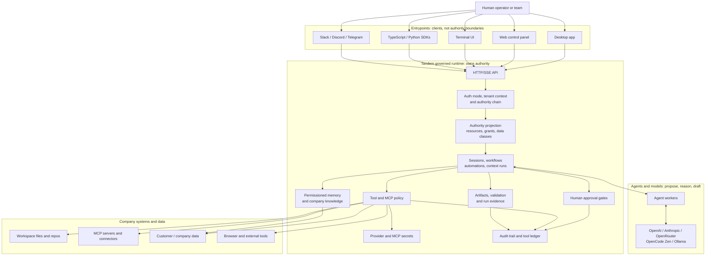

<div align="center">
  
  
  <p>
    <a href="https://tandem.ac/"></a>
    <a href="https://github.com/frumu-ai/tandem/actions/workflows/ci.yml"></a>
    <a href="https://github.com/frumu-ai/tandem/actions/workflows/publish-registries.yml"></a>
    <a href="https://github.com/frumu-ai/tandem/releases"></a>
    <a href="https://www.npmjs.com/package/@frumu/tandem-client"></a>
    <a href="https://pypi.org/project/tandem-client/"></a>
    <a href="docs/LICENSING.md"></a>
    <a href="https://github.com/sponsors/frumu-ai"></a>
  </p>
</div>

<p align="center">
  <a href="README.md">English</a> | <a href="README.zh-CN.md">简体中文</a>
</p>

<p align="center">
  <strong>对 Tandem Hosted 感兴趣？</strong>
  <a href="https://tandem.ac/agents?utm_source=github&utm_medium=readme&utm_campaign=hosted_waitlist&utm_content=top_banner">加入等待名单</a>
</p>

<h1 align="center">Tandem</h1>

**Tandem 在 AI agents 和它们使用的工具、数据、memory 与动作之间执行策略。**

Agents 可以推理、起草并提出工作。Tandem 决定它们被授权看到什么、可以调用哪些工具、哪些动作必须暂停等待审批、可以访问哪些 memory/context，以及哪些证据会被记录下来。

当 agents 触达真实公司系统时，Tandem 就很有用：文件、代码仓库、邮件、MCP tools、客户数据、内部文档、生产工作流和长期自动化。

对平台和安全团队来说，Tandem 是 agentic systems 的运行时控制平面：限定范围的工具访问、审批门、权限化 memory、tenant/resource boundaries 和审计证据。

**模型提出请求。Tandem 执行控制。**

从治理角度看，Tandem 在运行时管理 AI 智能体的委托权限。

## Tandem 做什么

- 用持久化状态运行 AI 工作流，而不是只依赖聊天记录。
- 按工作流步骤限定可见的内置工具和 MCP connectors。
- 在执行前阻止超出运行时策略的工具调用。
- 对重要动作暂停并要求人工审批。
- 控制一次 run 可以检索哪些公司记忆和上下文。
- 在模型上下文窗口之外记录 artifacts、tool events、approval decisions 和 audit evidence。

## 简单例子

某个 agent 可以被允许起草客户邮件，但不能直接发送。

Tandem 可以暴露 draft tool，隐藏或阻止 send tool，在审批门暂停，只有在人类批准后才继续，并把这次决策记录到 audit trail。

## Tandem 不是什么

| 不是这个                 | 而是这个                                                          |
| ------------------------ | ----------------------------------------------------------------- |
| Chatbot wrapper          | 位于 agents 和 workflows 之下的运行时层                           |
| 只是 agent framework     | 控制 agent workflows 能看见什么、能做什么的策略层                 |
| 只是 approval UI         | 运行时执行控制，审批只是其中一道受控关口                          |
| 只是 LLM gateway         | 治理 workflow state、tools、memory、approvals、artifacts 和 audit |
| 平面 RAG 系统            | Runtime-scoped memory 和 source-bound retrieval                   |
| Prompt-only safety layer | 在模型之外执行控制                                                |

Tandem 把这称为 **runtime authority（运行时权限控制）**：在模型之外执行授权、执行控制、审批、记忆范围限制和审计。桌面端、TUI、Web 控制面板、渠道和 SDK 等入口都是同一个 engine runtime 的客户端。

- **运行时拥有控制权：** runs、sessions、memory、context、provider secrets、MCP tools、approvals、artifacts 和 audit records 都位于模型之外。
- **受治理的工具执行：** 内置工具和 MCP connectors 可以按工作流步骤设定作用域，并为关键动作设置审批门。
- **租户感知运行时：** Hosted 和 enterprise 模式会把 tenant/principal context 带入 sessions、runs、context runs、memory、provider credentials、MCP secrets 和 events。
- **部署在数据所在之处：** Tandem 可以本地运行、无头运行、托管运行，也可以部署到客户自己的基础设施中。
- **模型提供商无绑定：** 支持 OpenRouter、Anthropic、OpenAI、OpenCode Zen 或本地 Ollama endpoint。

`Agent intent -> Runtime policy -> Scoped tool/data access -> Approval gates -> Artifacts -> Audit trail`

**-> [AI runtime infrastructure](docs/AI_RUNTIME_INFRASTRUCTURE.md) | [Enterprise readiness](docs/ENTERPRISE_READINESS.md) | [Runtime trust boundaries](docs/RUNTIME_TRUST_BOUNDARIES.md) | [EU AI Act readiness](docs/EU_AI_ACT_COMPLIANCE.md) | [Compliance starter pack](docs/compliance/README.md) | [通过 MCP 连接 agent](https://tandem.ac/docs-mcp)**

## 为什么需要 Tandem

Agent 正在变成 worker。它们会读取公司上下文、调用工具、创建 pull request、起草客户沟通、操作项目看板，并准备过去只存在于人类系统里的决策。

Prompt 不是权限。System prompt 可以要求模型不要调用某个工具、不要读取某个目录，或者等待审批，但模型本身不应该成为安全边界。Tandem 把这些控制放进运行时，因此 workflow 可以只授予 agent 当前步骤所需的工具、memory 和动作，并拒绝这个范围之外的一切。

公司也需要集中 AI 上下文，但不能把访问权限做成一张平面大网。权限化公司记忆应该知道公司知道什么，但某个 team、tenant、project 或 user 名下运行的 agent 只能检索它被允许使用的那一部分。

## Tandem 治理什么

- **公司知识和记忆：** 运行时拥有 memory、knowledge spaces 和 retrieval paths，并围绕 tenant/workspace boundary 设计。
- **工具和 MCP 可见性：** 内置工具和 MCP connector tools 可以按步骤设定作用域；面向企业部署的更完整 pre-invocation masking 已在规划中。
- **工作流执行：** 持久化 automation 和 context-run state，而不是只依赖脆弱的聊天记录。
- **人工审批：** 运行时 gates 会暂停 run，收集 approve/rework/cancel 决策，并留下证据。
- **租户和工作区边界：** sessions、runs、context runs、events、provider credentials、MCP secrets、memory，以及 resource scope/grant contract vocabulary 都带有边界语义。
- **Connector 凭证和 secrets：** Provider 和 MCP secret references 由运行时拥有；connector source binding 为 scoped ingestion 提供共享契约。
- **产物和审计轨迹：** Outputs、validations、tool ledger events、approval decisions 和 protected audit records 会保存在模型上下文窗口之外。

## 核心用例

| 用例                          | Tandem 增加的能力                                                                                   |
| ----------------------------- | --------------------------------------------------------------------------------------------------- |
| 审批门控的邮件和工作流        | Agent 提议动作，Tandem 在执行前暂停，由人审批或要求返工。                                           |
| 权限化公司知识库              | 公司 memory 和 knowledge spaces，带 tenant-aware retrieval 和 resource-grant vocabulary。           |
| 受治理的 coding agents        | Coder runs、worktree context、handoff artifacts、approval points 和可审计实现状态。                 |
| 项目、sprint、event brain     | 跨 session 和团队存活的长期 context、tasks、artifacts 和 memory。                                   |
| 租户隔离的 hosted automations | Hosted runtime records、event streams、provider credentials、MCP secrets 和 memory 按 tenant 隔离。 |
| 内部 agent 和工具治理         | 控制 agent 能看到哪些工具、能执行哪些动作，以及留下哪些证据。                                       |

## 为什么平台和安全团队会关心

Tandem 面向需要在真实运营控制下运行 AI 工作的团队：

- **运行时权限，而不是 prompt 权限：** 模型可以请求上下文或工具调用；运行时决定什么可见、什么可执行。
- **租户感知记录：** Sessions、automation runs、context runs、event streams、provider credentials、MCP secrets 和 memory paths 在 hosted/shared 模式中携带 tenant context。
- **资源与授权模型：** Tandem 对资源、主体、授权、数据分类和数据边界建模，使访问决策可以由运行时执行。
- **权限化记忆：** Memory 和 knowledge paths 携带 tenant boundaries，让公司知识有用但不变成全员可见的平面上下文。
- **可部署运行时：** 同一个 runtime 可以运行在 laptop、headless engine、hosted deployment 或客户基础设施里。
- **可审计性：** Approval decisions、policy denials、provider secret changes、MCP activity、tool ledger events、artifacts 和 protected audit records 都能在聊天记录之外被检查。

## 部署模型

Tandem 对本地使用有价值，也能向更严格的公司部署演进：

- **本地桌面端：** 单用户 desktop runtime，带本地 workspace scope、provider setup 和 approval-gated tools。
- **无头 engine：** `tandem-engine serve` 可供 SDK、control panels、automations 和 CI/dev 环境使用。
- **Hosted/private managed：** Hosted deployments 使用 transport-token 和 signed context assertions 实现 tenant-aware access。
- **客户基础设施：** 适合把运行时部署在公司数据、connector credentials 和运营证据所在的位置。

## 当前状态

| 当前能力                                                                                       | 企业路线图                                                                                  |
| ---------------------------------------------------------------------------------------------- | ------------------------------------------------------------------------------------------- |
| Runtime auth modes: `local_single_tenant`, `hosted_single_tenant`, `enterprise_required`       | Full RBAC、OIDC、SCIM、SIEM integrations、SOC2 package 和 enterprise identity policy bridge |
| Hosted/enterprise ingress 的 tenant context 和 signed context assertions                       | 带 fail-closed policy authorization 的 private enterprise sidecar                           |
| Tenant-aware sessions、automation runs、context runs、events、coder routes 和 memory APIs      | 覆盖所有路径的完整 artifact/export isolation                                                |
| Provider credential 和 MCP secret tenant boundaries                                            | 模型调用前的完整 tool-discovery masking                                                     |
| Memory tenant partitioning、tenant-scoped knowledge spaces 和 resource-scoped retrieval APIs   | 带 live external source ingestion 的 production connector ingestion admin platform          |
| Resource access-control contract types 和 strict context projection vocabulary                 | Signed approval receipts 和 auditor-grade immutable receipt chains                          |
| Approval gates、pending approval inbox、channel approvals、tool ledger events 和 audit records | 接入 production ingestion flows 的 advanced connector quarantine/revoke/rotate operations   |

## 合规和 EU AI Act readiness

Tandem 帮助团队用 human oversight、scoped tools、durable execution evidence 和 protected-action controls 运行 AI 工作流。对于受监管或安全敏感部署，请先阅读 [EU AI Act readiness brief](docs/EU_AI_ACT_COMPLIANCE.md)，再使用 [Compliance Starter Pack](docs/compliance/README.md) 做 control mapping、Article 50 transparency guidance、deployer instructions、Annex IV documentation template 和 limitations/responsibility matrix。

## 30 秒快速开始

### Web 控制面板

安装主 CLI，然后初始化控制面板和 engine service：

```bash
npm i -g @frumu/tandem
tandem install panel
tandem panel init
tandem panel open
```

当你需要由 engine 支撑的浏览器控制中心时，使用这个入口。

本地安装时，可以在 **Settings -> Providers -> openai-codex** 中选择 **Connect Codex Account**，通过浏览器登录，而不是粘贴 OpenAI API key。

### Desktop

1. 下载并启动 Tandem：[tandem.ac](https://tandem.ac/)
2. 打开 **Settings** 添加 provider API key，或在本地控制面板中为 `openai-codex` 连接 Codex account。
3. 选择 workspace folder。
4. 输入 task prompt，并选择 **Immediate** 或 **Plan Mode**。

### 可编辑 App Scaffold

在你自己的目录生成完全可编辑的 control panel app：

```bash
npm create tandem-panel@latest my-panel
cd my-panel
npm install
npm run dev
```

当你需要自定义 routes、pages、themes、styles 或 runtime behavior，但不想编辑 `node_modules` 时使用它。

### MCP-assisted setup

如果你想让已有 agent 帮你安装或配置 Tandem，先把该 agent 连接到 Tandem 的 MCP interface。MCP 文档说明了如何把你自己的 agent 接入 Tandem，让它协助 setup、configuration 和后续任务：

- [Tandem MCP docs](https://tandem.ac/docs-mcp)

如果你只需要 engine runtime，可以前台运行：

```bash
tandem-engine serve --hostname 127.0.0.1 --port 39731
```

### 其他入口

- TUI: `npm i -g @frumu/tandem-tui && tandem-tui`
- SDKs: `npm install @frumu/tandem-client` 或 `pip install tandem-client`

### Codex 和 Docker setup

- Codex 用户可以通过 [tandem-codex-plugin](https://github.com/frumu-ai/tandem-codex-plugin) 连接 Tandem。
- 如果想使用 Docker-based Tandem agents setup，请参考 [tandem-agents](https://github.com/frumu-ai/tandem-agents)。

## Open Core 和 Source-Available 架构

Tandem 首先面向开发者构建，并采用 open-core model。我们认为，要信任一个 AI runtime，你必须能够逐行审计 execution router。

**本地开发和评估：** 采用宽松许可（`MIT OR Apache-2.0`）的 crates 和 libraries 可按其各自条款使用。每个分发的 engine binary 还包含 source-available 的 `BUSL-1.1` components，可免费用于评估、开发、测试、源码审查、个人非商业用途以及非生产环境的 proofs of concept。

**企业路径：** 面向规模化组织部署的高级能力，例如 enterprise identity federation、更丰富的 policy enforcement、signed receipt chains、private sidecar enforcement、SIEM export 和 HA packaging，是规划中的企业能力，并可能受商业或 source-available 条款约束，包括在声明处使用 Business Source License 1.1 (`BUSL-1.1`)。

**许可边界：** 将 `BUSL-1.1` components 用于商业生产环境——包括内部生产使用、为客户进行的生产部署，以及 managed、hosted、SaaS、white-label、embedded、OEM 或 reseller 形式的产品或服务——需要向 Frumu LTD 获取单独的商业许可。逐 package 的准确条款见 [docs/LICENSING.md](docs/LICENSING.md)。

## 架构



## 常见工作流

| Governed workflow          | Tandem runtime 控制什么                                                                              |
| -------------------------- | ---------------------------------------------------------------------------------------------------- |
| Vendor 或 policy risk 评估 | 读取选定来源、起草带引用的 artifact、验证限制，并让 mutation tools 留在只读步骤之外。                |
| 审批门控的邮件或更新       | Agent 起草动作，runtime 在 human gate 暂停，记录 approve/rework/cancel 证据后继续。                  |
| 代码迁移                   | 追踪 coder runs、worktree state、changed files、validation、handoff artifacts 和 approval points。   |
| 外部 MCP tools 治理        | 按 workflow step 约束 connector tools，要求具体 tool evidence，并按 tenant path 隔离 MCP secrets。   |
| 权限化公司记忆             | 通过 runtime-owned memory 和 knowledge spaces 检索公司上下文，而不是把所有内容塞进 chat。            |
| 租户隔离 hosted workflows  | 在 hosted/shared modes 下按 tenant 隔离 sessions、runs、events、credentials、MCP secrets 和 memory。 |

## 功能

### 受治理的执行

- **模型不是控制系统：** 模型可以提出工作；Tandem 拥有 allowed tools、context、state transitions、approvals 和 audit evidence。
- **作用域化工作流执行：** Automation V2 nodes 可以携带 built-in tool 和 MCP connector policy，让不同步骤看到不同能力。
- **审批门控动作：** Runs 可以在关键工作前暂停，等待 approve/rework/cancel，并用 gate history 继续执行。
- **状态存活：** Checkpoints、replayable event history 和 materialized run states 能跨 API timeout 和 connector failure 存活。

### 权限化记忆和公司知识

- **Tenant-partitioned memory：** Vector-backed session、project、global 和 file-import memory paths 携带 tenant scope。
- **Knowledge spaces：** Curated knowledge spaces 和 items 可通过 tenant-aware APIs 管理。
- **运行时检索：** Agents 通过 runtime 检索 context，为 permissioned company memory 提供路径，而不是把所有内容塞进 transcript。

### Tenant 和 workspace isolation

- **Tenant-aware records：** Sessions、automation definitions/runs、context runs、event streams、provider credentials、MCP secret references、memory 和 coder routes 都携带 tenant context。
- **Strict context contract：** Resource refs、scoped grants、data classes、principals 和 data boundaries 在 enterprise contract 中建模。
- **保留本地行为：** Desktop 和 developer workflows 默认仍使用 local/default single-tenant 行为。

### MCP 和 tool governance

- **MCP connector support：** Tandem 可以连接 MCP servers、同步 tools，并把选定 connector tools 约束到 workflow nodes。
- **Secret isolation：** Store-backed MCP secret references 在 hosted/shared paths 中解析前会验证 tenant scope。
- **Tool discovery 是权限面：** Tool discovery 和 MCP visibility 由 runtime policy 治理；模型调用前完整隐藏 unauthorized tools 仍是 enterprise roadmap。

### 人工审批和审计

- **Approvals inbox 和 channel approvals：** Operators 可以从 runtime-owned approval surfaces approve、request rework 或 cancel。
- **持久证据：** Tool ledger events、gate history、artifacts、validation metadata 和 protected audit events 可以保存在模型上下文窗口之外。
- **Audit stream：** 已有 admin-facing audit streams 和 protected audit envelopes；immutable receipt chains 和 signed approval receipts 仍在路线图中。

### Multi-agent orchestration

- **Kanban-driven execution：** Agents 认领任务、报告 blocker，并通过确定性状态交接工作。
- **Memory-aware workers：** Agents 可以通过 runtime paths 使用 prior run context、project memory 和 knowledge spaces。
- **Revisioned coordination：** Engine-enforced locks 防止多个 agents 同时踩踏同一代码库。

### 本地和 self-hosted controls

- MCP tool connectors
- Scheduled automations 和 routines
- Headless runtime with HTTP + SSE APIs
- Windows、macOS 和 Linux desktop runtime
- API keys 使用 local SecureKeyStore 加密（AES-256-GCM）
- Local Codex OAuth credentials 由 engine 拥有；browser UI 只发起登录，不持久化 refresh tokens
- Workspace access 仅限你明确授权的 folders
- Write/delete operations 通过 supervised tool flow 要求审批
- 默认拒绝敏感路径（`.env`、`.ssh/*`、`*.pem`、`*.key`、secrets folders）
- Tandem 本身没有 analytics 或 call-home telemetry

### Outputs 和 artifacts

- Markdown reports
- HTML dashboards
- PowerPoint (`.pptx`) generation

## Enterprise Path 和 Roadmap

Tandem 已经包含用于 hosted 和 self-managed 环境中治理 AI 工作的 runtime building blocks。下一阶段企业能力会围绕这些 building blocks 强化 identity、policy、audit export 和 administration。

Available now:

- Runtime auth modes 和 hosted/enterprise signed context assertion verification。
- Tenant-aware sessions、runs、context runs、event streams、provider credentials、MCP secrets、memory 和 coder routes。
- Resource access-control contract vocabulary：resources、scopes、principals、grants、data classes 和 data boundaries。
- Approval gates、protected audit records、audit streams、tool ledger events 和 runtime artifacts。
- Connector source-binding contracts：secret references、resource refs、data classes、quarantine/revoke/rotate vocabulary 和 scoped memory chunk references。

Planned enterprise capabilities:

- Full RBAC、OIDC/SSO、SCIM、SIEM export、SOC2 package 和 enterprise admin workflows。
- Private enterprise sidecar 和 policy bridge，并支持 required-mode fail-closed enforcement。
- Signed approval receipts、immutable receipt chains 和更广泛的 audit/export isolation。
- 模型调用前完整 tool-discovery masking。
- Production external connector ingestion admin platform 和 production ingestion flows。

## Programmatic API

SDK 是 API client。它们**不**内置 `tandem-engine`。
你需要先运行 Tandem runtime（desktop sidecar 或 headless engine），然后用 SDK 创建 sessions、触发 runs、流式读取 events。

Runtime options:

- 本地 desktop app（会启动 sidecar runtime）
- 通过 npm 启动 headless engine：

  ```bash
  npm install -g @frumu/tandem
  tandem-engine serve --hostname 127.0.0.1 --port 39731
  ```

- TypeScript SDK: [@frumu/tandem-client](https://www.npmjs.com/package/@frumu/tandem-client)
- Python SDK: [tandem-client](https://pypi.org/project/tandem-client/)
- Engine package: [@frumu/tandem](https://www.npmjs.com/package/@frumu/tandem)

```typescript
// npm install @frumu/tandem-client
import { TandemClient } from "@frumu/tandem-client";

const client = new TandemClient({ baseUrl: "http://localhost:39731", token: "..." });
const sessionId = await client.sessions.create({ title: "My agent" });
const { runId } = await client.sessions.promptAsync(sessionId, "Summarize README.md");

for await (const event of client.stream(sessionId, runId)) {
  if (event.type === "session.response") process.stdout.write(event.properties.delta ?? "");
}
```

```python
# pip install tandem-client
from tandem_client import TandemClient

async with TandemClient(base_url="http://localhost:39731", token="...") as client:
    session_id = await client.sessions.create(title="My agent")
    run = await client.sessions.prompt_async(session_id, "Summarize README.md")
    async for event in client.stream(session_id, run.run_id):
        if event.type == "session.response":
            print(event.properties.get("delta", ""), end="", flush=True)
```

## Provider setup

在 **Settings** 中配置 providers。

| Provider                 | Description                                      | Get API key                                                          |
| ------------------------ | ------------------------------------------------ | -------------------------------------------------------------------- |
| **OpenAI Codex Account** | Browser sign-in for local Codex-account usage    | Local control panel: **Settings -> Providers -> openai-codex**       |
| **OpenRouter** ⭐        | Access many models through one API               | [openrouter.ai/keys](https://openrouter.ai/keys)                     |
| **OpenCode Zen**         | Fast, cost-effective models optimized for coding | [opencode.ai/zen](https://opencode.ai/zen)                           |
| **Anthropic**            | Anthropic models (Sonnet, Opus, Haiku)           | [console.anthropic.com](https://console.anthropic.com/settings/keys) |
| **OpenAI**               | GPT models and OpenAI endpoints                  | [platform.openai.com](https://platform.openai.com/api-keys)          |
| **Ollama**               | Local models (no remote API key required)        | [Setup Guide](docs/OLLAMA_GUIDE.md)                                  |
| **Custom**               | OpenAI-compatible API endpoint                   | Configure endpoint URL                                               |

Notes:

- `openai-codex` 当前面向 local engine-backed Tandem setups。
- 标准 OpenAI API keys 仍可用于普通 `openai` provider。

## Web search setup

`websearch` 可直接在以下位置配置：

- Desktop: **Settings -> Web Search**
- Control panel: 连接 local managed engine 时使用 **Settings -> Web Search**

Recommended default:

- `Backend = auto`
- 添加 Brave key、Exa key，或二者都添加

`auto` 会优先使用已配置 providers，并可在 backends 之间 fallback，而不是把 engine 固定到单一 hosted search path。Headless installs 仍可通过 env vars 配置：

```env
TANDEM_SEARCH_BACKEND=auto
TANDEM_BRAVE_SEARCH_API_KEY=...
TANDEM_EXA_API_KEY=...
TANDEM_SEARXNG_URL=http://127.0.0.1:8080
TANDEM_SEARCH_URL=https://search.tandem.ac
```

如果 Brave 被 rate-limit 且 Exa 已配置，`auto` 可以继续使用 Exa，而不是立即把 search 标记为 unavailable。

## 设计原则

- **Local-first runtime**：数据和状态留在你的机器上，除非你把 prompt/tool 内容发送给已配置 providers。
- **Supervised execution**：AI 通过受控工具运行，write/delete operations 需要显式审批。
- **Provider agnostic**：使用你选择的 model providers。
- **可审计源码和清晰许可边界**：本仓库是 mixed-license：permissive `MIT`、`Apache-2.0`、`MIT OR Apache-2.0` components 与 source-available `BUSL-1.1` compiler/governance components 并存，详见 [docs/LICENSING.md](docs/LICENSING.md)。

## 安全和隐私

- **Telemetry**：Tandem 不包含 analytics/tracking 或 call-home telemetry。
- **Provider traffic**：AI request content 只会发送到你配置的 endpoints（cloud providers 或 local Ollama/custom endpoints）。
- **Network scope**：Desktop runtime 与 local sidecar (`127.0.0.1`) 和已配置 endpoints 通信。
- **Updater/release checks**：App update 和 release metadata flows 可能联系 GitHub endpoints。
- **Credential storage**：Provider keys 使用 AES-256-GCM 加密存储。
- **Filesystem safety**：Access 限于已授权 folders；sensitive paths 默认拒绝。

完整 threat model 和 reporting process 见 [SECURITY.md](SECURITY.md)。

## Learn more

- Architecture overview: [ARCHITECTURE.md](ARCHITECTURE.md)
- Engine runtime + CLI reference: [docs/ENGINE_CLI.md](docs/ENGINE_CLI.md)
- Desktop/runtime communication contract: [docs/ENGINE_COMMUNICATION.md](docs/ENGINE_COMMUNICATION.md)
- Engine testing and smoke checks: [docs/ENGINE_TESTING.md](docs/ENGINE_TESTING.md)
- Docs portal: [docs.tandem.ac](https://docs.tandem.ac/)

Advanced MCP behavior（包括 OAuth/auth-required flows 和 retries）见 [docs/ENGINE_CLI.md](docs/ENGINE_CLI.md)。

## Advanced setup（从源码构建）

### Prerequisites

- [Node.js](https://nodejs.org/) 20+
- [Rust](https://rustup.rs/) 1.75+（包含 `cargo`）
- [pnpm](https://pnpm.io/)（推荐）或 npm

| Platform | Additional requirements                                                                          |
| -------- | ------------------------------------------------------------------------------------------------ |
| Windows  | [Build Tools for Visual Studio](https://visualstudio.microsoft.com/downloads/)                   |
| macOS    | Xcode Command Line Tools: `xcode-select --install`                                               |
| Linux    | `libwebkit2gtk-4.1-dev`, `libappindicator3-dev`, `librsvg2-dev`, `build-essential`, `pkg-config` |

### Local development

```bash
git clone https://github.com/frumu-ai/tandem.git
cd tandem
pnpm install
cargo build -p tandem-ai
pnpm tauri dev
```

### Production build and signing notes

```bash
pnpm tauri build
```

如果你要构建自己的 updater artifacts，请生成自己的 signing keys 并配置：

1. `pnpm tauri signer generate -w ./src-tauri/tandem.key`
2. `TAURI_SIGNING_PRIVATE_KEY`
3. `TAURI_SIGNING_PASSWORD`
4. `src-tauri/tauri.conf.json` 中的 `pubkey`

参考：[Tauri signing documentation](https://tauri.app/v1/guides/distribution/updater/#signing-updates)

Output paths:

```bash
# Windows: src-tauri/target/release/bundle/msi/
# macOS:   src-tauri/target/release/bundle/dmg/
# Linux:   src-tauri/target/release/bundle/appimage/
```

### macOS install troubleshooting

如果下载的 `.dmg` 显示 “damaged” 或 “corrupted”，通常是 Gatekeeper 拒绝了未 Developer ID signed 和 notarized 的 app bundle/DMG。

1. 确认架构正确（`aarch64/arm64` vs `x86_64/x64`）。
2. 尝试通过 Finder 打开（`Right click -> Open` 或 `System Settings -> Privacy & Security -> Open Anyway`）。
3. 面向非技术分发时，请从 release automation 发布 signed + notarized artifacts。

## Contributing

欢迎贡献。请阅读 [CONTRIBUTING.md](CONTRIBUTING.md)。

```bash
# Run lints
pnpm lint

# Run tests
pnpm test
cargo test

# Format code
pnpm format
cargo fmt
```

Engine-specific build/run/smoke instructions: `docs/ENGINE_TESTING.md`
Engine CLI usage reference: `docs/ENGINE_CLI.md`
Engine runtime communication contract: `docs/ENGINE_COMMUNICATION.md`

### Maintainer release note

- Desktop binary/app release: `.github/workflows/release.yml`（tag pattern `v*`）
- Registry publish（crates.io + npm wrappers）：`.github/workflows/publish-registries.yml`（manual trigger 或 `publish-v*`）
- 这两个 workflows 有意拆分

## Project structure

```text
tandem/
├── src/                    # React frontend
│   ├── components/         # UI components
│   ├── hooks/              # React hooks
│   └── lib/                # Utilities
├── src-tauri/              # Rust backend
│   ├── src/                # Rust source
│   ├── capabilities/       # Permission config
│   └── binaries/           # Sidecar (gitignored)
├── scripts/                # Build scripts
└── docs/                   # Documentation
```

## 支持这个项目

如果 Tandem 帮你节省了时间，欢迎 [赞助开发](https://github.com/sponsors/frumu-ai)。

[❤️ 成为赞助者](https://github.com/sponsors/frumu-ai)

## Star history

[](https://www.star-history.com/#frumu-ai/tandem&type=date&logscale&legend=top-left)

## License

本仓库使用 mixed licensing model。[docs/LICENSING.md](docs/LICENSING.md) 是 canonical package-by-package map。

- Core engine crates and tools（例如 `tandem-core`、`tandem-server`、`tandem-types`、`tandem-orchestrator` 以及 `crates/` 中的其他组件）：
  - 除非 manifest 或 local license 另有说明，否则使用 `MIT OR Apache-2.0`
  - 见 [LICENSE-MIT](LICENSE-MIT) 和 [LICENSE-APACHE](LICENSE-APACHE)

- Mission compiler crate（`tandem-plan-compiler`）：
  - 使用 Business Source License 1.1 (`BUSL-1.1`)
  - 见 `crates/tandem-plan-compiler/LICENSE`

- Governance engine crate（`tandem-governance-engine`）：
  - 使用 Business Source License 1.1 (`BUSL-1.1`)
  - 见 `crates/tandem-governance-engine/LICENSE`

- Incident monitor crate（`tandem-incident-monitor`）：
  - 使用 Business Source License 1.1 (`BUSL-1.1`)
  - 见 `crates/tandem-incident-monitor/LICENSE`

- Enterprise server crate（`tandem-enterprise-server`）：
  - 使用 Business Source License 1.1 (`BUSL-1.1`)
  - 见 `crates/tandem-enterprise-server/LICENSE`

- Engine server crate（`tandem-server`，自 0.7.0 起）：
  - 使用 Business Source License 1.1 (`BUSL-1.1`)
  - 见 `crates/tandem-server/LICENSE`

简而言之：Tandem 是 open core。Permissive protocol、SDK、client 和 local tooling surfaces 是 open source；engine server、mission/plan compiler、recursive governance engine、incident monitor 和 enterprise server 在 Business Source License 条款下 source-available。

本仓库中的任何 license 均不授予商标权。"Tandem"、"Frumu" 及相关 logos 是 Frumu LTD 的商标——使用政策见 [TRADEMARKS.md](TRADEMARKS.md)。

## 致谢

- [Anthropic](https://anthropic.com) 提供 Cowork 方向的启发
- [Tauri](https://tauri.app) 提供安全的桌面应用框架
- 开源社区
