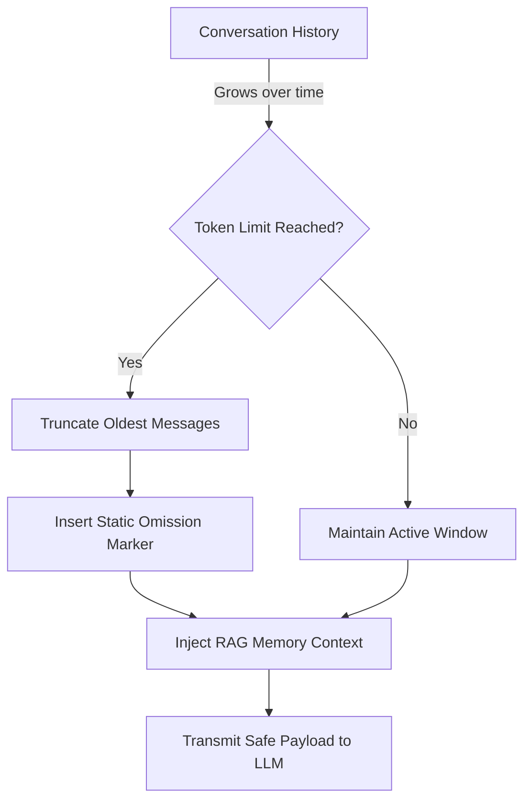

## Agents

In Tandem, an **Agent** is a specialized persona with specific instructions, permissions, and tools.

For policy-gated multi-agent spawning and lineage tracking, see [Agent Teams](./agent-teams/).

### Built-in Agents

Tandem comes with several built-in agents:

- **`build` (Default)**: Focused on implementation. Inspects the codebase before answering.
- **`plan`**: Focused on high-level planning and scoping.
- **`explore`**: A sub-agent for gathering context and mapping the codebase.
- **`general`**: A general-purpose helper.

### Custom Agents

You can define custom agents by creating markdown files in `.tandem/agent/`.
Example: `.tandem/agent/reviewer.md`

```markdown
---
name: reviewer
mode: primary
tools: ["read", "scan"]
---

You are a code review agent. Focus on finding bugs and security issues.
```

### Agent Modes

- **Primary**: Can be selected as the main agent for a session.
- **Subagent**: Designed to be called by other agents (or used for specific sub-tasks), usually hidden from the main selection menu.

## Sessions

A **Session** is a conversation thread with an agent.

- Sessions are persisted in `storage/session/`.
- Each session maintains its own message history and context.
- You can switch agents mid-session, though it is usually better to start a new session for a different mode of work.

### Infinite Context Protection

Tandem sessions are designed to run indefinitely without suffering from "context snowballing"—a common issue where agent rules and tool metadata accumulate until the LLM's token limit is completely exhausted.



As your conversation grows, Tandem employs a strict sliding window: it gracefully truncates older turns, replacing them with a static placeholder marking the omission. Instead of forcing the LLM to re-read summarized rules repetitively, the engine relies on a governed knowledge layer: run-scoped working state stays local, validated project knowledge is reused selectively, and the engine records why knowledge was reused, skipped, or refreshed. This keeps the context boundary stable without turning memory into a garbage dump.

## The Loop

When you send a message, the **Engine Loop**:

1. Appends your message to the history.
2. Selects the active agent's system prompt.
3. Sends the context to the LLM.
4. **Tool Use**: If the LLM requests a tool (e.g., `read_file`), the Engine checks permissions, executes the tool, and feeds the output back to the LLM.
5. This repeats until the LLM produces a final text response.
